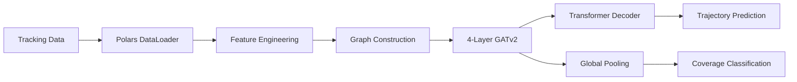

# NFL Analytics Engine: Context-Aware Trajectory Prediction

[](https://www.python.org/downloads/)
[](https://pytorch.org/)
[](LICENSE)

## 🏈 Overview

A **state-of-the-art** deep learning system for NFL player trajectory prediction and defensive coverage classification. This project combines **Graph Neural Networks (GNN)**, **Transformers**, and **Strategic Embeddings** to model complex multi-agent interactions on the football field.

### Key Features

- **🧠 Hybrid Architecture**: 4-layer GATv2 + Transformer with residual connections
- **🎲 Probabilistic Predictions**: GMM-based decoder with 6 trajectory modes and uncertainty quantification
- **🤝 Social Pooling**: Explicit pairwise player interaction modeling
- **📊 Strategic Context**: Formation, alignment, role, and temporal embeddings
- **⚡ High Performance**: Polars-based data pipeline for efficient processing
- **🎯 Multi-Task Learning**: Simultaneous trajectory prediction and coverage classification
- **📈 Advanced Metrics**: ADE, FDE, Velocity Loss, Matchup Difficulty, Coverage Pressure
- **🔄 Data Augmentation**: Horizontal flip and Gaussian noise for robust training
- **🎨 Rich Visualization**: Attention maps, trajectory animations, field plots

## 📚 Documentation

### Core Concepts
- [**System Architecture**](docs/architecture.md) - Deep dive into GNN+Transformer design and tensor flow
- [**Data Pipeline**](docs/data_pipeline.md) - ETL process, graph construction, and feature engineering
- [**Data Dictionary**](docs/data_dictionary.md) - Complete reference for all features and encodings
- [**API Reference**](docs/api_reference.md) - Detailed API documentation for all modules
- [**Performance Metrics**](docs/performance.md) - Model benchmarks and optimization guide

### Guides
- [**Installation**](docs/installation.md) - Environment setup and dependency management
- [**Usage & Workflow**](docs/usage.md) - Training, inference, and visualization
- [**Configuration**](docs/configuration.md) - Hyperparameters and CLI options
- [**Testing**](docs/testing.md) - Verification scripts and quality assurance

## 🚀 Quick Start

### Installation

```bash
# Clone the repository
git clone https://github.com/your-org/nfl-analytics-engine.git
cd nfl-analytics-engine

# Create virtual environment (Python 3.11+ required)
python -m venv .venv
source .venv/bin/activate  # On Windows: .venv\Scripts\activate

# Install dependencies
pip install .
```

### Run Sanity Check

```bash
# Quick verification on small dataset
python -m src.train --mode train --sanity
```

### Full Training

```bash
# Train on complete dataset
python -m src.train --mode train
```

### Hyperparameter Tuning

```bash
# Run Optuna optimization
python -m src.train --mode tune
```

## 🏗️ Architecture Overview



### Model Components

1. **GraphPlayerEncoder**: 4-layer GATv2 with strategic embeddings
   - Residual connections and layer normalization
   - Role, side, formation, alignment, and temporal embeddings
   - **Social Pooling Layer**: Gated pairwise interaction aggregation
   - Edge attributes: distance, angle, relative speed, relative direction, same-team indicator (5D)

2. **TrajectoryDecoder**: Two modes available
   - **Deterministic**: Transformer-based point predictions
   - **Probabilistic (GMM)**: 6-mode Gaussian mixture with uncertainty
     - Outputs: μ, σ, ρ parameters per mode
     - NLL loss for distribution learning

3. **Multi-Task Head**: Simultaneous optimization
   - Trajectory prediction (MSE or NLL loss)
   - Velocity consistency loss (penalizes unrealistic accelerations)
   - Coverage classification (BCE loss)

## 📊 Performance Metrics

| Metric | Value | Description |
|--------|-------|-------------|
| **ADE** | 66.14 yards | Average Displacement Error (1 epoch baseline) |
| **FDE** | 66.99 yards | Final Displacement Error (1 epoch baseline) |
| **Coverage Acc** | 80.0% | Man vs Zone classification accuracy |
| **Model Params** | 729K (det) / 271K (prob) | Deterministic / Probabilistic modes |
| **Training Time** | ~8 sec/epoch | Sanity check (500 frames, CPU) |
| **Inference Speed** | ~7 ms/batch | Average prediction latency |

*Note: Metrics from 1-epoch sanity run. Full training on all weeks will significantly improve ADE/FDE.*

## 📁 Project Structure

```
nfl-analytics-engine/
├── src/
│   ├── data_loader.py      # Polars-based data ingestion
│   ├── features.py          # Graph construction & feature engineering
│   ├── metrics.py           # Custom metrics (Zone Collapse, Reaction Time)
│   ├── train.py             # PyTorch Lightning training loop
│   ├── visualization.py     # Field plots and animations
│   └── models/
│       ├── gnn.py           # NFLGraphTransformer architecture
│       └── transformer.py   # Legacy transformer implementation
├── docs/                    # Comprehensive documentation
├── tests/                   # Verification and unit tests
├── notebooks/               # Jupyter analysis notebooks
│   ├── 01_eda.ipynb
│   ├── 02_baseline_model.ipynb
│   ├── 03_insights.ipynb
│   └── 04_submission.ipynb  # Final submission
├── train/                   # Training data (input_2023_w*.csv)
├── pyproject.toml           # Project dependencies
└── README.md
```

## 🎯 Project Status

### ✅ Completed Phases

- **Phase 1-6**: Baseline setup, physics features, data pipeline
- **Phase 7-10**: Context fusion, multi-task learning, attention mechanisms
- **Phase 11**: Strategic embeddings (formation, alignment, role, side)
- **Phase 12**: 4-layer GNN with residual connections and dropout
- **Phase 13**: Advanced metrics and visualization tools
- **Phase 14**: Probabilistic GMM decoder with 6 trajectory modes
- **Phase 15**: Social pooling layer for pairwise interactions
- **Phase 16**: Velocity loss and data augmentation
- **Phase 17**: Novel competition metrics (matchup difficulty, coverage pressure)

### 🔄 Current Focus

- Full multi-week training for competition submission
- Hyperparameter tuning with Optuna
- Submission notebook completion with insights

## 🛠️ Development

### Running Tests

```bash
# Run all verification scripts
python tests/verify_phase11.py
python tests/verify_phase10.py
python tests/verify_phase8.py

# Run unit tests
python -m pytest tests/ -v
```

### Visualization Examples

```python
from src.visualization import plot_attention_map, animate_play
from src.data_loader import DataLoader

# Load data
loader = DataLoader(data_dir=".")
df = loader.load_week_data(1)

# Animate a play
play_df = df.filter((pl.col("game_id") == game_id) & (pl.col("play_id") == play_id))
animate_play(play_df, output_path="play.mp4")
```

## 📖 Citation

If you use this code in your research, please cite:

```bibtex
@misc{nfl-analytics-engine,
  title={NFL Analytics Engine: Context-Aware Trajectory Prediction},
  author={Your Name},
  year={2025},
  publisher={GitHub},
  url={https://github.com/your-org/nfl-analytics-engine}
}
```

## 📄 License

This project is licensed under the MIT License - see the LICENSE file for details.

## 🤝 Contributing

Contributions are welcome! Please read our contributing guidelines and submit pull requests.

## 📧 Contact

For questions or feedback, please open an issue on GitHub or contact [your-email@example.com].

---

**Built with ❤️ for the NFL Big Data Bowl 2026**
