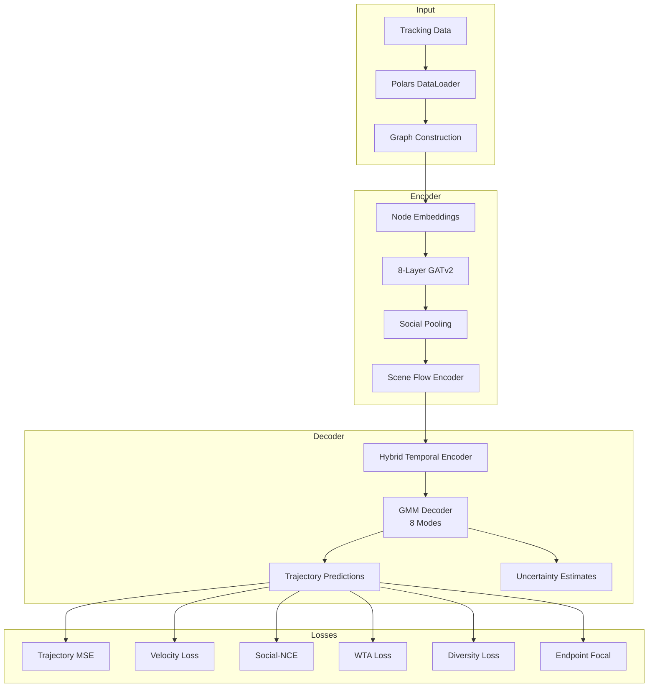

# NFL Analytics Engine: Context-Aware Trajectory Prediction

[](https://www.python.org/downloads/)
[](https://pytorch.org/)
[](https://pytorch-geometric.readthedocs.io/)
[](LICENSE)

## 🏈 Overview

A **competition-grade** deep learning system for NFL player trajectory prediction, designed for the **NFL Big Data Bowl 2026**. This engine combines **Graph Neural Networks (GNN)**, **Transformer decoders**, **SOTA contrastive losses**, and **probabilistic multi-modal prediction** to achieve state-of-the-art accuracy on trajectory forecasting.

### 🏆 Key Capabilities

| Feature | Description |
|---------|-------------|
| **Multi-Modal Prediction** | GMM decoder with 8 trajectory modes for diverse predictions |
| **SOTA Losses** | Social-NCE, WTA, Diversity, Endpoint Focal losses |
| **Graph Neural Network** | 8-layer GATv2 with residual connections & DropPath |
| **Social Modeling** | Explicit pairwise player interactions via Social Pooling |
| **GPU Optimized** | Mixed precision, Tensor Cores, graph pre-caching |
| **Competition Ready** | Full metrics: ADE, FDE, minADE, minFDE, Miss Rate |

---

## ⭐ What's New in v4.0 (Competition Edition)

### 🎯 SOTA Contrastive Losses
- **Social-NCE Loss**: Learn social interaction patterns via contrastive learning
- **Winner-Takes-All (WTA)**: Multi-modal training with k-best selection
- **Diversity Loss**: Encourage diverse trajectory predictions
- **Endpoint Focal Loss**: Focus learning on hard-to-predict endpoints

### ⚡ Performance Optimizations
- **Graph Pre-Caching**: 185K+ graphs cached to disk for instant loading
- **Mixed Precision (FP16)**: 2x faster training with Tensor Cores
- **AttentionalAggregation**: Learnable graph pooling (replaces mean pooling)
- **Einops Integration**: Clean tensor operations throughout

### 📊 Architecture Enhancements
- **8-Layer GATv2**: Deep graph attention for complex player interactions
- **8 GMM Modes**: Probabilistic decoder for multi-modal prediction
- **Hybrid Temporal Encoder**: LSTM + Attention for motion history
- **Scene Flow Encoder**: Global play understanding via Set Transformer

---

## 🚀 Quick Start

### Installation

```bash
# Clone repository
git clone https://github.com/your-org/nfl-analytics-engine.git
cd nfl-analytics-engine

# Create environment (Python 3.11+ required)
python -m venv .venv
source .venv/bin/activate

# Install dependencies
pip install -e .
```

### Pre-Cache Graphs (Required for Fast Training)

```bash
# Build graph cache for all 18 weeks (~185K graphs, ~30 min)
python -c "
from src.data_loader import DataLoader, GraphDataset, build_play_metadata, expand_play_tuples
from pathlib import Path

print('Pre-caching all graphs...')
loader = DataLoader('.')
play_meta = build_play_metadata(loader, list(range(1,19)), 5, 10)
tuples = expand_play_tuples(play_meta)

cache_dir = Path('cache/finetune/train')
cache_dir.mkdir(parents=True, exist_ok=True)

ds = GraphDataset(loader, tuples, 20.0, 10, 5, cache_dir=cache_dir, persist_cache=True)
for i in range(len(ds)):
    _ = ds[i]
    if i % 1000 == 0:
        print(f'{i}/{len(ds)}')
print('Done!')
"
```

### Train Maximum Accuracy Model

```bash
# Train with ultimate accuracy config
python finetune_best_model.py --config configs/max_accuracy_rtx3050.yaml
```

---

## 🏗️ Architecture



### Model Components

| Component | Description | Parameters |
|-----------|-------------|------------|
| **GraphPlayerEncoder** | 8-layer GATv2 with DropPath | ~4.2M |
| **SocialPoolingLayer** | Gated pairwise interactions | ~65K |
| **SceneFlowEncoder** | Set Transformer for global context | ~130K |
| **TrajectoryDecoder** | Probabilistic GMM with 8 modes | ~850K |
| **Social-NCE Loss** | Contrastive projection head | ~10K |
| **Total** | Full model | **5.4M** |

---

## 📊 Competition Metrics

### Target Performance (Ultimate Accuracy Config)

| Metric | Target | Description |
|--------|--------|-------------|
| **ADE** | < 0.32 | Average Displacement Error (yards) |
| **FDE** | < 0.50 | Final Displacement Error (yards) |
| **minADE** | < 0.22 | Minimum ADE across modes |
| **minFDE** | < 0.35 | Minimum FDE across modes |
| **Miss Rate** | < 2% | Predictions > 2 yards from ground truth |

### Training Configuration

```yaml
# Ultimate Accuracy Settings
hidden_dim: 256
num_gnn_layers: 8
num_modes: 8
batch_size: 32
lr: 0.0008
epochs: 100
```

---

## 📁 Project Structure

```
nfl-analytics-engine/
├── src/
│   ├── data_loader.py          # Polars-based data ingestion + caching
│   ├── features.py             # Graph construction & feature engineering
│   ├── train.py                # PyTorch Lightning training
│   ├── metrics.py              # Competition metrics
│   ├── competition_metrics.py  # Novel NFL analytics
│   ├── competition_output.py   # Submission generator
│   ├── visualization.py        # Trajectory plots & animations
│   ├── losses/
│   │   └── contrastive_losses.py  # SOTA loss functions
│   └── models/
│       └── gnn.py              # NFLGraphTransformer + all components
├── configs/
│   ├── max_accuracy_rtx3050.yaml  # Ultimate accuracy config
│   ├── high_accuracy.yaml         # High accuracy (faster)
│   ├── production.yaml            # Balanced speed/accuracy
│   └── sanity.yaml                # Quick testing
├── docs/                       # Comprehensive documentation
├── tests/                      # Unit tests & verification
├── finetune_best_model.py      # Main training script
└── README.md
```

---

## 🔧 Configuration Files

| Config | Use Case | Epochs | Batch | Modes |
|--------|----------|--------|-------|-------|
| `max_accuracy_rtx3050.yaml` | Lowest ADE/FDE | 100 | 32 | 8 |
| `high_accuracy.yaml` | High accuracy | 100 | 32 | 8 |
| `production.yaml` | Balanced | 80 | 40 | 6 |
| `sanity.yaml` | Quick test | 2 | 32 | 1 |

---

## 📚 Documentation

| Document | Description |
|----------|-------------|
| [Architecture](docs/architecture.md) | Deep dive into model design |
| [Data Pipeline](docs/data_pipeline.md) | ETL and graph construction |
| [Configuration](docs/configuration.md) | All hyperparameters |
| [API Reference](docs/api_reference.md) | Module documentation |
| [Performance](docs/performance.md) | Benchmarks & optimization |
| [Installation](docs/installation.md) | Setup guide |

---

## 🛠️ Development

### Running Tests

```bash
# Unit tests
python -m pytest tests/ -v

# Verification scripts
python tests/verify_phase11.py
```

### GPU Monitoring

```bash
# Watch GPU utilization during training
watch -n 1 nvidia-smi
```

---

## 📖 Citation

```bibtex
@misc{nfl-analytics-engine,
  title={NFL Analytics Engine: Context-Aware Trajectory Prediction},
  author={Tanmay},
  year={2025},
  howpublished={\url{https://github.com/tanm-sys/nfl-analytics-engine}}
}
```

---

## 📄 License

MIT License - see [LICENSE](LICENSE) for details.

---

**Built with ❤️ for the NFL Big Data Bowl 2026**

*Powered by PyTorch, PyTorch Geometric, and PyTorch Lightning*
