# NFL Analytics Engine: Context-Aware Trajectory Prediction

[](https://www.python.org/downloads/)
[](https://pytorch.org/)
[](https://pytorch-geometric.readthedocs.io/)
[]()
[](LICENSE)

## 🏈 Overview

A **competition-grade** deep learning system for NFL player trajectory prediction, designed for the **NFL Big Data Bowl 2026**. This engine combines **Graph Neural Networks (GNN)**, **Transformer decoders**, **SOTA contrastive losses**, and **probabilistic multi-modal prediction** to achieve state-of-the-art accuracy.

> **🏆 Model Size**: 12M parameters - optimized for RTX 3050 4GB VRAM

---

## ⭐ Key Features


---

## 🏗️ System Architecture

### High-Level Pipeline


### Detailed Model Architecture

```mermaid
flowchart LR
    subgraph GATv2["GATv2 Block (×8)"]
        direction TB
        GA1["Input: [N, 384]"] --> GA2["Multi-Head Attention<br/>12 Heads"]
        GA2 --> GA3["DropPath<br/>p=0.18"]
        GA3 --> GA4["Residual Add"]
        GA4 --> GA5["LayerNorm"]
        GA5 --> GA6["Output: [N, 384]"]
    end
    
    subgraph GMM["GMM Decoder"]
        direction TB
        GM1["Context: [N, 384]"] --> GM2["Transformer<br/>6 Layers"]
        GM2 --> GM3["Mode Heads<br/>×16"]
        GM3 --> GM4["μ: [N, 10, 16, 2]"]
        GM3 --> GM5["σ: [N, 10, 16, 2]"]
        GM3 --> GM6["π: [N, 16]"]
    end
```



---

## 📊 Model Specifications

### Parameter Count

| Component | Parameters | % of Total |
|-----------|------------|------------|
| Graph Encoder (8 layers) | 8.2M | 68% |
| GMM Decoder (16 modes) | 2.8M | 23% |
| Scene Encoder | 0.5M | 4% |
| Embeddings | 0.4M | 3% |
| SOTA Losses | 0.1M | 2% |
| **Total** | **12.0M** | 100% |

### Architecture Details

```yaml
# Maximum Parameters Config
hidden_dim: 384           # 1.5× default
num_gnn_layers: 8         # Deep network
heads: 12                 # Multi-head attention
num_modes: 16             # Maximum multi-modal
dropout: 0.08
droppath_rate: 0.18
```

---

## 🚀 Quick Start

### 1. Install Dependencies

```bash
git clone https://github.com/tanm-sys/nfl-analytics-engine.git
cd nfl-analytics-engine
pip install -e .
```

### 2. Pre-Cache Graphs (Required)

```bash
python -c "
from src.data_loader import *
from pathlib import Path

loader = DataLoader('.')
play_meta = build_play_metadata(loader, list(range(1,19)), 5, 10)
tuples = expand_play_tuples(play_meta)

cache_dir = Path('cache/finetune/train')
cache_dir.mkdir(parents=True, exist_ok=True)

ds = GraphDataset(loader, tuples, 20.0, 10, 5,
                  cache_dir=cache_dir, persist_cache=True)
for i, _ in enumerate(ds):
    if i % 1000 == 0: print(f'{i}/{len(ds)}')
"
```

### 3. Train Maximum Parameters Model

```bash
python finetune_best_model.py --config configs/max_accuracy_rtx3050.yaml
```

---

## 🎯 Training Pipeline


---

## 📈 Loss Functions


---

## 🎛️ Configuration Options

| Config | Parameters | Batch | Epochs | Use Case |
|--------|------------|-------|--------|----------|
| `max_accuracy_rtx3050.yaml` | **12.0M** | 16 | 200 | Competition |
| `high_accuracy.yaml` | 5.4M | 32 | 100 | High quality |
| `production.yaml` | 3.2M | 48 | 80 | Fast training |
| `sanity.yaml` | 1.0M | 64 | 2 | Quick test |

---

## 📂 Project Structure

```
nfl-analytics-engine/
├── src/
│   ├── models/
│   │   └── gnn.py              # NFLGraphTransformer (12M params)
│   ├── losses/
│   │   └── contrastive_losses.py  # SOTA losses
│   ├── data_loader.py          # Polars + PyG caching
│   ├── train.py                # Lightning module
│   ├── competition_metrics.py  # Novel metrics
│   └── competition_output.py   # Submission generator
├── configs/
│   ├── max_accuracy_rtx3050.yaml  # Maximum parameters
│   └── *.yaml                  # Other configs
├── docs/                       # Documentation
├── cache/                      # Graph cache (1.8GB)
└── checkpoints_finetuned/      # Model checkpoints
```

---

## 📚 Documentation

| Document | Description |
|----------|-------------|
| [Architecture](docs/architecture.md) | Model design & tensor flows |
| [Configuration](docs/configuration.md) | All hyperparameters |
| [Data Pipeline](docs/data_pipeline.md) | ETL & caching |
| [API Reference](docs/api_reference.md) | Module documentation |
| [Performance](docs/performance.md) | Benchmarks |
| [Installation](docs/installation.md) | Setup guide |
| [Usage](docs/usage.md) | Training & inference |
| [Testing](docs/testing.md) | Verification |

---

## 🏆 Competition Metric: RMSE

> **Evaluation**: Submissions are evaluated using **Root Mean Squared Error (RMSE)** between predicted and observed target positions.

```
RMSE = √(mean((pred - target)²))
```

### Target Performance (12M Model)

| Metric | Target | World-Class | Description |
|--------|--------|-------------|-------------|
| **RMSE** | < 0.35 | < 0.28 | Competition metric |
| **minRMSE** | < 0.25 | < 0.20 | Best mode RMSE |
| ADE | < 0.22 | < 0.18 | Secondary metric |
| FDE | < 0.35 | < 0.28 | Secondary metric |
| Miss Rate | < 0.5% | < 0.2% | Secondary metric |

---

## 📖 Citation

```bibtex
@misc{nfl-analytics-engine,
  title={NFL Analytics Engine: Context-Aware Trajectory Prediction},
  author={Tanmay},
  year={2025},
  howpublished={\url{https://github.com/tanm-sys/nfl-analytics-engine}}
}
```

---

**Built with ❤️ for NFL Big Data Bowl 2026**

*Powered by PyTorch • PyTorch Geometric • PyTorch Lightning*
