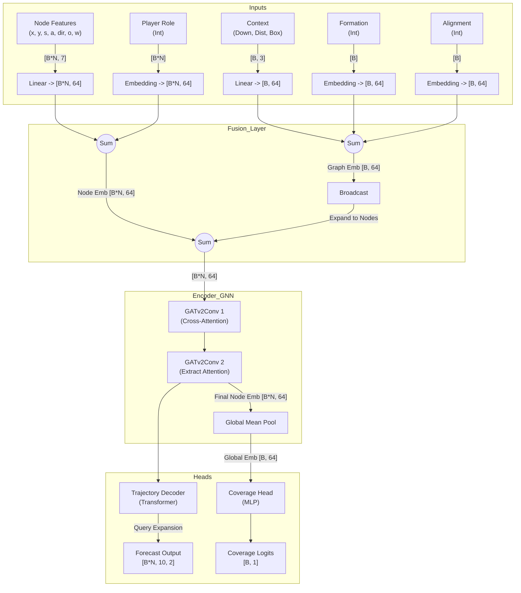
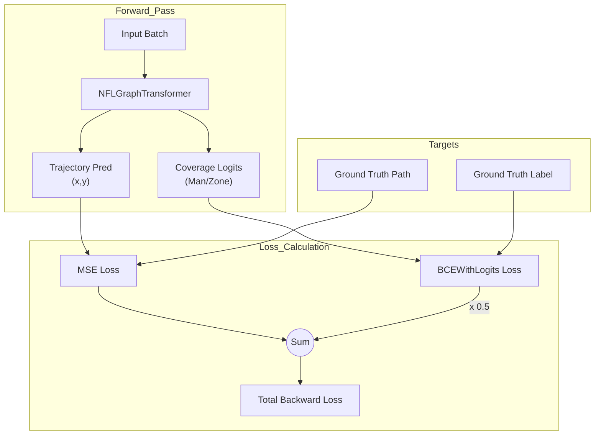

# System Architecture

## Overview
The NFL Analytics Engine is a **Hybrid Graph-Transformer** model designed to solve the "Multi-Agent Trajectory Prediction" problem in American Football. It combines spatial reasoning (Graph Neural Networks) with temporal sequence modeling (Transformers) and strategic context awareness.

## Tensor Flow Diagram

## Component Specifications

### 1. GraphPlayerEncoder
**Input Shapes**:
*   `x`: `[Total_Nodes, 7]` (Batch * ~22 Players)
*   `context`: `[Batch_Size, 3]`
*   `role`: `[Total_Nodes]` (Long)
*   `formation/alignment`: `[Batch_Size]` (Long)

**Fusion Logic**:
The model uses residual-style fusion to combine specific logic (Nodes) with global logic (Context).
1.  **Node Stream**: $h_{node} = Linear(x) + Embedding(role)$
2.  **Context Stream**: $h_{ctx} = Linear(c) + Embedding(formation) + Embedding(alignment)$
3.  **Combined**: $h_{in} = h_{node} + Broadcast(h_{ctx})$

### 2. GATv2 Layers
**Mechanism**:
*   Uses `edge_attr` (Distance, Angle) to modulate attention scores.
*   **Layer 1**: Aggregates neighborhood info.
*   **Layer 2**: Refines embeddings and extracts *Attention Weights* ($\alpha_{ij}$) for Explainability.

### 3. Trajectory Decoder
**Temporal Expansion**:
*   Takes spatial embeddings `[Total_Nodes, 64]`.
*   Repeats them `Future_Seq_Len` (10) times.
*   Adds learned `Query Position Embeddings` to distinguish $t+1$ from $t+10$.
*   Transformer Encoder processes the sequence.
*   Output Head projects to $\Delta x, \Delta y$.

## Training & Loss Flow

The model optimizes two objectives simultaneously (Multi-Task Learning).

3.  **Feature Engineering**:
    *   Standardizes play direction (Left-to-Right).
    *   Encodes categorical features (Formation, Role) into IDs.
    *   Normalizes continuous features (Weight, Down, Distance).
4.  **Graph Construction**: Converts frames into PyG `Data` objects with `edge_index` and `edge_attr`.
5.  **Inference**: The model processes the graph batch and outputs predictions.
