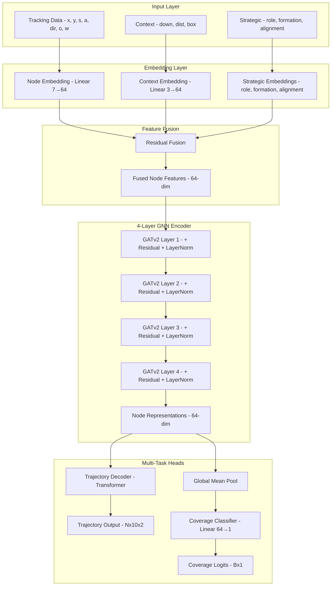
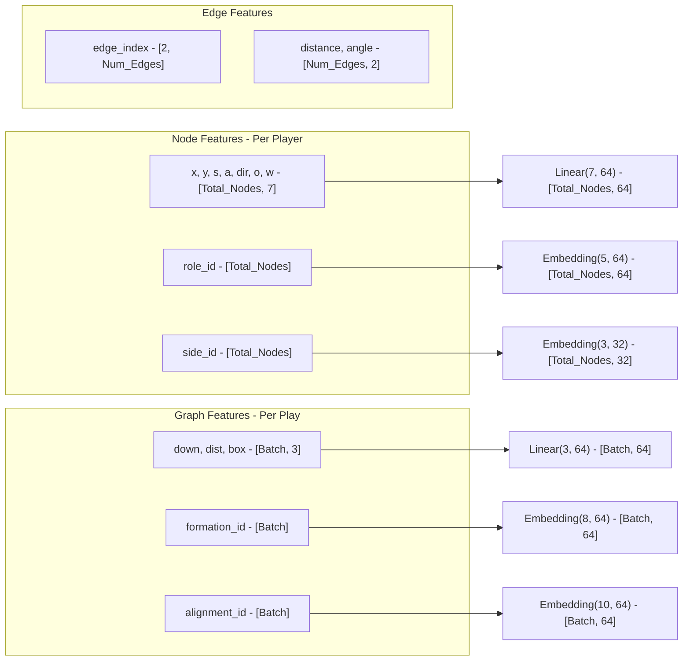
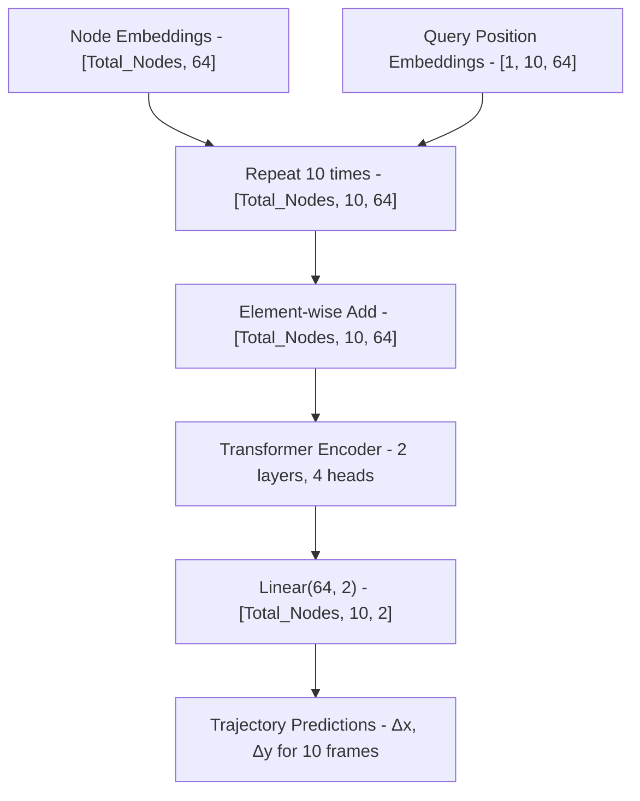
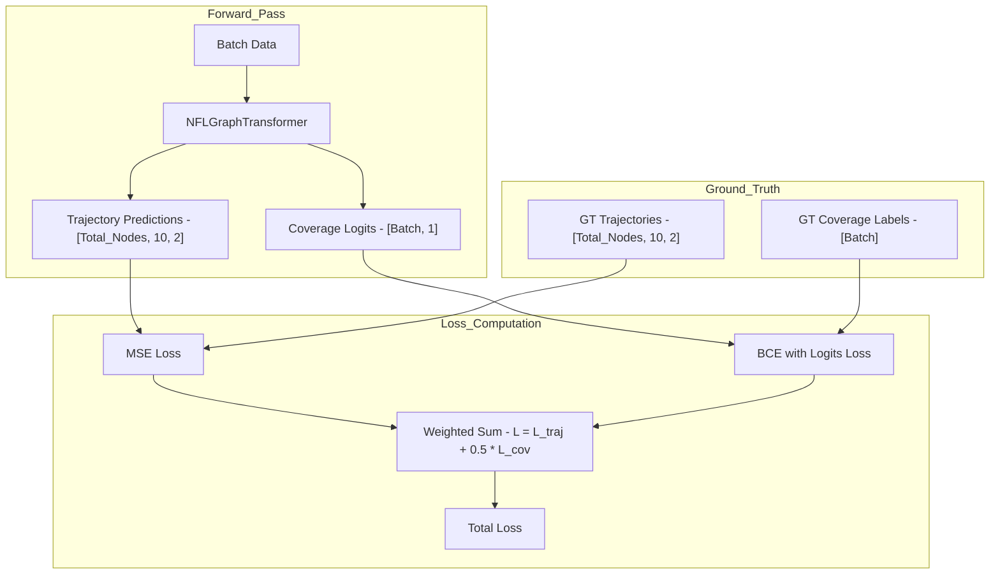
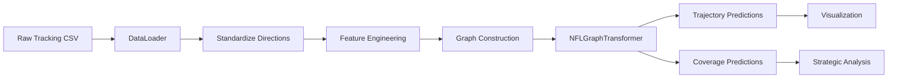

# System Architecture

## Overview

The NFL Analytics Engine is a **Hybrid Graph-Transformer** model designed to solve the multi-agent trajectory prediction problem in American Football. It combines spatial reasoning (Graph Neural Networks) with temporal sequence modeling (Transformers) and strategic context awareness through learned embeddings.

### Design Philosophy

1. **Spatial Reasoning**: GATv2 layers model player-to-player interactions within each frame
2. **Temporal Modeling**: Transformer decoder predicts future trajectories
3. **Strategic Context**: Embeddings capture formation, alignment, and role information
4. **Multi-Task Learning**: Simultaneous trajectory prediction and coverage classification

### v2.0 Enhancements (P0-P3)

5. **Relative Predictions (P0)**: Predict displacements instead of absolute positions
6. **Motion History (P1)**: LSTM encodes past 5 frames of velocity/acceleration
7. **Scene Understanding (P3)**: Set Transformer captures global play dynamics
8. **Hierarchical Decoding (P3)**: Coarse-to-fine trajectory refinement

## High-Level Architecture



## Detailed Tensor Flow

### Input Processing



### Embedding Fusion

The model uses **residual-style fusion** to combine node-level and graph-level features:

**Node Stream:**
$$h_{node} = \text{Linear}(x) + \text{Embedding}(role) + \text{Pad}(\text{Embedding}(side))$$

**Graph Stream:**
$$h_{graph} = \text{Linear}(context) + \text{Embedding}(formation) + \text{Embedding}(alignment)$$

**Broadcast and Fuse:**
$$h_{input} = h_{node} + \text{Broadcast}(h_{graph})$$

Where `Broadcast` expands graph-level embeddings to each node using the batch index.

### Graph Attention Network

The model uses **4 stacked GATv2 layers** with residual connections:

```python
for i in range(4):
    h_residual = h
    h = GATv2Conv(h, edge_index, edge_attr)
    h = ReLU(h)
    h = Dropout(h, p=0.1)
    h = LayerNorm(h + h_residual)  # Residual connection
```

**GATv2 Attention Mechanism:**

For each edge $(i, j)$:

$$\alpha_{ij} = \frac{\exp(\text{LeakyReLU}(\mathbf{a}^T [\mathbf{W}h_i \| \mathbf{W}h_j \| \mathbf{e}_{ij}]))}{\sum_{k \in \mathcal{N}(i)} \exp(\text{LeakyReLU}(\mathbf{a}^T [\mathbf{W}h_i \| \mathbf{W}h_k \| \mathbf{e}_{ik}]))}$$

Where:
- $h_i, h_j$ are node features
- $\mathbf{e}_{ij}$ are edge attributes (distance, angle)
- $\mathbf{W}$ is learnable weight matrix
- $\mathbf{a}$ is attention parameter vector

**Node Update:**
$$h_i' = \sum_{j \in \mathcal{N}(i)} \alpha_{ij} \mathbf{W} h_j$$

### Trajectory Decoder

The trajectory decoder uses a **Transformer architecture** to predict future positions:



**Key Features:**
- **Non-autoregressive**: Predicts all 10 future frames simultaneously
- **Query embeddings**: Learned positional encodings distinguish t+1 from t+10
- **Per-agent prediction**: Each player gets independent trajectory

### Multi-Task Learning

The model optimizes two objectives simultaneously:



**Loss Function:**
$$\mathcal{L} = \mathcal{L}_{trajectory} + \lambda \mathcal{L}_{coverage}$$

Where:
- $\mathcal{L}_{trajectory} = \text{MSE}(\hat{y}, y)$ - Mean Squared Error for trajectory
- $\mathcal{L}_{coverage} = \text{BCE}(\hat{c}, c)$ - Binary Cross-Entropy for coverage
- $\lambda = 0.5$ - Coverage loss weight

## Component Specifications

### 1. GraphPlayerEncoder

**Purpose**: Encode spatial state and strategic context into node embeddings

**Input Dimensions:**
- `x`: `[Total_Nodes, 7]` - Node features (x, y, s, a, dir, o, w)
- `edge_index`: `[2, Num_Edges]` - Graph connectivity
- `edge_attr`: `[Num_Edges, 2]` - Edge features (distance, angle)
- `context`: `[Batch, 3]` - Game context (down, dist, box)
- `role`: `[Total_Nodes]` - Player role IDs (0-4)
- `side`: `[Total_Nodes]` - Team side IDs (0-2)
- `formation`: `[Batch]` - Formation IDs (0-7)
- `alignment`: `[Batch]` - Alignment IDs (0-9)
- `batch`: `[Total_Nodes]` - Batch assignment vector

**Architecture:**
```python
GraphPlayerEncoder(
    input_dim=7,
    hidden_dim=64,
    heads=4,
    context_dim=3,
    edge_dim=2,
    num_layers=4,
    dropout=0.1
)
```

**Output:**
- `node_embeddings`: `[Total_Nodes, 64]`
- `attention_weights`: `(edge_index, alpha)` - Optional for visualization

### 2. TrajectoryDecoder

**Purpose**: Predict future trajectory from spatial embeddings

**Input:**
- `context_emb`: `[Total_Nodes, 64]` - Node embeddings from GNN

**Architecture:**
```python
TrajectoryDecoder(
    hidden_dim=64,
    num_heads=4,
    future_seq_len=10
)
```

**Output:**
- `predictions`: `[Total_Nodes, 10, 2]` - Future (Δx, Δy) for 10 frames

### 3. NFLGraphTransformer

**Purpose**: Complete end-to-end model

**Forward Pass:**
```python
def forward(data, return_attention_weights=False):
    # 1. Encode spatial + strategic features
    node_embs, attn = encoder(
        x=data.x,
        edge_index=data.edge_index,
        edge_attr=data.edge_attr,
        context=data.context,
        role=data.role,
        side=data.side,
        formation=data.formation,
        alignment=data.alignment,
        batch=data.batch
    )
    
    # 2. Decode trajectories
    trajectories = decoder(node_embs)
    
    # 3. Classify coverage
    global_emb = global_mean_pool(node_embs, data.batch)
    coverage = classifier(global_emb)
    
    return trajectories, coverage, attn
```

## Edge Construction

Edges are created using a **radius graph** approach:

1. **Compute pairwise distances** between all players in a frame
2. **Create edges** where distance < 20 yards
3. **Compute edge attributes**:
   - **Distance**: Euclidean distance in yards
   - **Relative angle**: Angle from player i to player j

```python
# Radius graph construction
edge_index = radius_graph(
    x=positions,  # [N, 2] (x, y coordinates)
    r=20.0,       # 20 yard radius
    batch=batch,  # Batch assignment
    loop=False    # No self-loops
)

```
# Edge attributes
edge_attr = compute_edge_features(positions, edge_index)
# Returns [Num_Edges, 2]: [distance, angle]
```

## Model Capacity

**Parameter Count (v2.0 with P0-P3):**

| Component | Parameters | Description |
|-----------|-----------|-------------|
| Node Embedding | 448 | Linear(7, 64) |
| Role Embedding | 320 | Embedding(5, 64) |
| Side Embedding | 96 | Embedding(3, 32) |
| Context Encoder | 192 | Linear(3, 64) |
| Formation Embedding | 512 | Embedding(8, 64) |
| Alignment Embedding | 640 | Embedding(10, 64) |
| GATv2 Layers (×4) | ~65K | 4 layers with residual |
| Layer Norms (×4) | 512 | 4 × LayerNorm(64) |
| **TemporalHistoryEncoder (P1)** | ~33K | 2-layer LSTM for motion history |
| **SceneFlowEncoder (P3)** | ~25K | Set Transformer with inducing points |
| Trajectory Decoder | ~33K | Transformer + head |
| Coverage Classifier | 65 | Linear(64, 1) |
| **Total** | **~810K** | Full model with P1/P3 |

## Training Configuration

**Optimizer:** Adam
- Learning rate: 1e-3 (tunable)
- Weight decay: 1e-5

**Regularization:**
- Dropout: 0.1 (in GNN layers)
- Layer normalization after each GATv2 layer

**Batch Size:** 32 graphs (adjustable based on GPU memory)

**Training Strategy:**
1. Load data with Polars DataLoader
2. Construct graphs with radius=20.0
3. Forward pass through model
4. Compute multi-task loss
5. Backpropagate and update weights
6. Log metrics (ADE, FDE, Coverage Accuracy)

## Inference Pipeline



**Steps:**
1. Load tracking data for a play
2. Standardize coordinates (left-to-right)
3. Engineer features (normalize weights, encode roles)
4. Construct graph with edges
5. Run model inference
6. Extract predictions and attention weights
7. Visualize results

## Key Design Decisions

### Why GATv2 over GAT?

GATv2 uses **dynamic attention** where the attention mechanism can learn different patterns:
- GAT: $\alpha_{ij} = \text{softmax}(\mathbf{a}^T [\mathbf{W}h_i \| \mathbf{W}h_j])$
- GATv2: $\alpha_{ij} = \text{softmax}(\mathbf{a}^T \text{LeakyReLU}(\mathbf{W}[h_i \| h_j]))$

The LeakyReLU before the attention parameter allows more expressive attention patterns.

### Why 4 Layers?

Empirical testing showed:
- 2 layers: Underfitting, limited receptive field
- 4 layers: Optimal balance of capacity and training stability
- 6+ layers: Diminishing returns, harder to train

### Why Residual Connections?

Residual connections enable:
- **Gradient flow**: Prevents vanishing gradients in deep networks
- **Feature preservation**: Maintains low-level features alongside high-level abstractions
- **Training stability**: Easier optimization landscape

### Why Multi-Task Learning?

Training on both trajectory and coverage:
- **Shared representations**: Forces model to learn strategic patterns
- **Regularization**: Coverage task acts as auxiliary objective
- **Practical utility**: Both predictions useful for analysis

## Extensibility

The architecture is designed for easy extension:

1. **Add new strategic features**: Simply add new embedding layers
2. **Modify GNN depth**: Change `num_layers` parameter
3. **Alternative decoders**: Replace TrajectoryDecoder with RNN/LSTM
4. **Additional tasks**: Add new heads (e.g., play outcome prediction)
5. **Attention visualization**: Extract and plot attention weights

## References

- **GATv2**: Brody et al., "How Attentive are Graph Attention Networks?" (2021)
- **Transformers**: Vaswani et al., "Attention is All You Need" (2017)
- **Multi-Agent Prediction**: Alahi et al., "Social LSTM" (2016)
- **Graph Neural Networks**: Kipf & Welling, "Semi-Supervised Classification with GCNs" (2017)
