# System Architecture

> Deep dive into the NFL Analytics Engine's neural network design, tensor flows, and SOTA components.

## 🏗️ High-Level Architecture

```mermaid
graph TB
    subgraph "Data Layer"
        A[Tracking CSV] --> B[Polars DataLoader]
        B --> C[Graph Cache]
        C --> D[PyG DataLoader]
    end
    
    subgraph "Encoder Stack"
        D --> E[NodeEmbedding<br/>input_dim→256]
        E --> F[StrategicEmbeddings<br/>role, side, formation]
        F --> G[TemporalEmbedding<br/>frame position]
        G --> H[8x GATv2 Blocks<br/>+DropPath +LayerNorm]
        H --> I[SocialPooling<br/>pairwise interactions]
    end
    
    subgraph "Scene Understanding"
        I --> J[SceneFlowEncoder<br/>Set Transformer]
        J --> K[AttentionalAggregation<br/>graph pooling]
    end
    
    subgraph "Decoder Stack"
        K --> L[TemporalHistoryEncoder<br/>LSTM + Attention]
        L --> M[GMMDecoder<br/>8 modes]
        M --> N1[μ: positions]
        M --> N2[σ: uncertainty]
        M --> N3[π: mode probs]
    end
    
    subgraph "Loss Functions"
        N1 --> L1[TrajectoryMSE]
        N1 --> L2[VelocityLoss]
        N1 --> L3[SocialNCE]
        M --> L4[WTALoss]
        M --> L5[DiversityLoss]
        N1 --> L6[EndpointFocal]
    end
```



---

## 📐 Tensor Shapes Reference

### Input Tensors

| Tensor | Shape | Description |
|--------|-------|-------------|
| `x` | `[N, 9]` | Node features (pos, vel, acc, speed, dir) |
| `edge_index` | `[2, E]` | Edge connectivity |
| `edge_attr` | `[E, 5]` | Edge features (dist, angle, rel_speed, rel_dir, same_team) |
| `batch` | `[N]` | Batch assignment per node |
| `context` | `[B, 3]` | Down, distance, box count |
| `history` | `[N, 5, 4]` | Motion history (vel_x, vel_y, acc_x, acc_y) |

### Output Tensors

| Tensor | Shape | Description |
|--------|-------|-------------|
| `predictions` | `[N, 10, 2]` | Trajectory predictions (10 frames, x/y) |
| `mu` | `[N, 10, 8, 2]` | GMM means (8 modes) |
| `sigma` | `[N, 10, 8, 2]` | GMM std deviations |
| `mode_probs` | `[N, 8]` | Mode probabilities |
| `coverage` | `[B, 1]` | Coverage classification |

---

## 🧠 Core Components

### 1. GraphPlayerEncoder

The heart of the model - encodes player state with GNN layers.

```python
class GraphPlayerEncoder(nn.Module):
    """
    8-layer GATv2 with strategic embeddings.
    
    Features:
    - Residual connections every layer
    - DropPath (stochastic depth) regularization
    - LayerNorm for stability
    - Role, side, formation, alignment embeddings
    """
    
    # Architecture:
    # input_dim (9) → hidden_dim (256)
    # 8x [GATv2 → DropPath → Residual → LayerNorm]
    # → SocialPooling → output
```

**Key Parameters:**

| Parameter | Default | Description |
|-----------|---------|-------------|
| `input_dim` | 9 | Node feature dimension |
| `hidden_dim` | 256 | Hidden layer dimension |
| `num_layers` | 8 | Number of GATv2 layers |
| `heads` | 8 | Attention heads per layer |
| `dropout` | 0.1 | Dropout rate |
| `droppath_rate` | 0.12 | Stochastic depth rate |

### 2. SocialPoolingLayer

Captures explicit pairwise player interactions.

```python
class SocialPoolingLayer(nn.Module):
    """
    Gated aggregation of pairwise interactions.
    
    For each node, aggregates information from neighbors
    using learnable gating mechanism.
    """
    
    # Pairwise: concat(node_i, node_j) → MLP → gate
    # Aggregation: sum(gate * neighbor_features)
```

### 3. SceneFlowEncoder

Global scene understanding via Set Transformer.

```python
class SceneFlowEncoder(nn.Module):
    """
    Captures overall play dynamics using inducing points.
    
    Based on Set Transformer (Lee et al., 2019).
    Efficient O(N*K) complexity vs O(N^2) attention.
    """
    
    # K inducing points attend to all N nodes
    # Pooled to single scene embedding per graph
```

### 4. LearnableGraphPooling

SOTA graph-level aggregation using AttentionalAggregation.

```python
class LearnableGraphPooling(nn.Module):
    """
    Replaces mean pooling with learned attention.
    
    Gate network determines node importance.
    Transform network creates pooled representation.
    """
    
    # gate_nn: node → importance score (scalar)
    # nn_transform: node → transformed features
    # output: weighted sum based on gate scores
```

### 5. GMM Trajectory Decoder

Probabilistic multi-modal prediction.

```python
class ProbabilisticTrajectoryDecoder(nn.Module):
    """
    Gaussian Mixture Model decoder for multi-modal trajectories.
    
    Outputs distribution parameters for K modes:
    - μ (mean positions)
    - σ (standard deviations)
    - ρ (correlation coefficients)
    - π (mode weights)
    """
    
    # Per mode: hidden_dim → 5 params (μx, μy, σx, σy, ρ)
    # Mode selection: Softmax over K modes
```

---

## 🎯 Loss Functions

### Core Losses

| Loss | Weight | Description |
|------|--------|-------------|
| **Trajectory MSE** | 1.0 | Primary position loss |
| **Velocity** | 0.5 | Smooth motion constraint |
| **Acceleration** | 0.3 | Physical plausibility |
| **Collision** | 0.15 | Player collision avoidance |
| **Coverage** | 0.6 | Zone coverage accuracy |

### SOTA Contrastive Losses

#### Social-NCE Loss
```python
class SocialNCELoss(nn.Module):
    """
    Contrastive learning for social interactions.
    
    Positive: Trajectories of interacting players
    Negative: Non-interacting or far players
    
    Temperature-scaled NT-Xent loss.
    """
```

#### Winner-Takes-All (WTA) Loss
```python
class WinnerTakesAllLoss(nn.Module):
    """
    Multi-modal training with k-best selection.
    
    Only backprop through best k modes per sample.
    Encourages mode specialization.
    
    k_best: 2 (default)
    """
```

#### Diversity Loss
```python
class DiversityLoss(nn.Module):
    """
    Encourages diverse trajectory predictions.
    
    Penalizes modes that are too similar.
    Minimum distance threshold: 2.0 yards.
    """
```

#### Endpoint Focal Loss
```python
class EndpointFocalLoss(nn.Module):
    """
    Focus learning on hard endpoints.
    
    Focal loss formulation for trajectory endpoints.
    Higher weight for large errors.
    
    gamma: 2.5 (focusing parameter)
    """
```

---

## ⚡ GPU Optimization

### Mixed Precision Training

```python
# Enabled via PyTorch Lightning
precision="16-mixed"  # FP16 with dynamic scaling

# Tensor Core optimization
torch.set_float32_matmul_precision('medium')
```

### Graph Pre-Caching

```python
# Pre-computed graphs stored on disk
# Eliminates CPU bottleneck during training

GraphDataset(
    cache_dir="cache/finetune/train",
    persist_cache=True,
    in_memory_cache_size=200,  # Keep 200 graphs in RAM
)
```

### Memory-Efficient Batch Processing

```
Batch Size: 32
Accumulate Gradients: 5
Effective Batch: 160

GPU Memory: ~3.5GB / 4GB (RTX 3050)
```

---

## 📊 Model Summary

```
┏━━━━━━━━━━━━━━━━━━━━━━━┳━━━━━━━━━━━━━━━━━━━━━━━┳━━━━━━━━━━━┓
┃ Component             ┃ Type                  ┃ Parameters┃
┡━━━━━━━━━━━━━━━━━━━━━━━╇━━━━━━━━━━━━━━━━━━━━━━━╇━━━━━━━━━━━┩
│ model                 │ NFLGraphTransformer   │    5.3M   │
│ social_nce_loss       │ SocialNCELoss         │   10.3K   │
│ wta_loss              │ WinnerTakesAllLoss    │       0   │
│ diversity_loss        │ DiversityLoss         │       0   │
│ endpoint_focal_loss   │ EndpointFocalLoss     │       0   │
├───────────────────────┼───────────────────────┼───────────┤
│ TOTAL                 │                       │    5.4M   │
└───────────────────────┴───────────────────────┴───────────┘
```

---

## 🔧 Forward Pass Flow

```python
def forward(batch):
    # 1. Node embedding
    h = embedding(x) + role_emb(role) + side_emb(side)
    
    # 2. Context fusion
    h = h + context_emb(context)  # Broadcast to nodes
    
    # 3. GNN layers (8x)
    for gat, droppath, norm in layers:
        h = h + droppath(gat(h, edge_index, edge_attr))
        h = norm(h)
    
    # 4. Social pooling
    h = h + social_pool(h, edge_index)
    
    # 5. Scene encoding
    scene = scene_encoder(h, batch)
    
    # 6. Trajectory decoding
    mu, sigma, mode_probs = decoder(h, scene)
    
    # 7. Best trajectory selection
    best_mode = mode_probs.argmax(dim=-1)
    predictions = mu[..., best_mode, :]
    
    return predictions, coverage, attention_weights
```

---

## 📚 References

- **GATv2**: Brody et al., "How Attentive are Graph Attention Networks?" (2022)
- **DropPath**: Huang et al., "Deep Networks with Stochastic Depth" (2016)
- **Set Transformer**: Lee et al., "Set Transformer" (2019)
- **Social-NCE**: Liu et al., "Social NCE: Contrastive Learning for Social Agents" (2021)
- **Trajectron++**: Salzmann et al., "Trajectron++" (2020)
