# System Architecture

> Deep dive into the NFL Analytics Engine's 12M parameter neural network design.

## 🏗️ Architecture Overview

```mermaid
flowchart TB
    subgraph Input["📥 Input Layer"]
        direction LR
        I1["Node Features<br/>[N, 9]"]
        I2["Edge Index<br/>[2, E]"]
        I3["Edge Attr<br/>[E, 5]"]
        I4["Context<br/>[B, 3]"]
    end
    
    subgraph Embedding["🔤 Embedding Layer"]
        direction TB
        E1["Linear(9→384)"]
        E2["Role Embed(5→128)"]
        E3["Side Embed(3→64)"]
        E4["Formation Embed(8→128)"]
        E5["Temporal Embed(100→384)"]
        E1 --> EF["Fused: [N, 384]"]
        E2 --> EF
        E3 --> EF
        E4 --> EF
        E5 --> EF
    end
    
    subgraph GNN["🧠 Graph Neural Network (8 Layers)"]
        direction TB
        G1["GATv2 Layer 1<br/>12 heads"]
        G2["GATv2 Layer 2"]
        G3["..."]
        G4["GATv2 Layer 8"]
        G1 --> G2 --> G3 --> G4
    end
    
    subgraph Social["🤝 Social Modeling"]
        S1["Social Pooling<br/>Pairwise Gates"]
        S2["Scene Flow Encoder<br/>Set Transformer"]
        S3["Attentional Agg<br/>Graph Pooling"]
        S1 --> S2 --> S3
    end
    
    subgraph Decoder["🎯 GMM Decoder"]
        D1["Temporal LSTM"]
        D2["Transformer<br/>6 layers"]
        D3["Mode Heads ×16"]
        D1 --> D2 --> D3
    end
    
    subgraph Output["📤 Outputs"]
        O1["μ: [N,10,16,2]"]
        O2["σ: [N,10,16,2]"]
        O3["π: [N,16]"]
        O4["Coverage: [B,1]"]
    end
    
    Input --> Embedding
    Embedding --> GNN
    GNN --> Social
    Social --> Decoder
    Decoder --> Output
    
    style Input fill:#e3f2fd
    style Embedding fill:#fff3e0
    style GNN fill:#f3e5f5
    style Social fill:#e8f5e9
    style Decoder fill:#fce4ec
    style Output fill:#fff8e1
```



---

## 📐 Tensor Flow Diagram

```mermaid
flowchart LR
    subgraph Shapes["Tensor Shapes Through Network"]
        T1["Input<br/>[N, 9]"] --> T2["Embed<br/>[N, 384]"]
        T2 --> T3["GNN×8<br/>[N, 384]"]
        T3 --> T4["Social<br/>[N, 384]"]
        T4 --> T5["Scene<br/>[B, 384]"]
        T5 --> T6["Decode<br/>[N, 10, 384]"]
        T6 --> T7["GMM<br/>[N, 10, 16, 5]"]
    end
```



### Complete Shape Reference

| Layer | Input Shape | Output Shape | Parameters |
|-------|-------------|--------------|------------|
| Node Embedding | `[N, 9]` | `[N, 384]` | 3.8K |
| Role Embedding | `[N]` | `[N, 128]` | 640 |
| Side Embedding | `[N]` | `[N, 64]` | 192 |
| GATv2 Layer (×8) | `[N, 384]` | `[N, 384]` | ~1M each |
| Social Pooling | `[N, 384]` | `[N, 384]` | 300K |
| Scene Encoder | `[N, 384]` | `[B, 384]` | 500K |
| Temporal LSTM | `[N, 5, 4]` | `[N, 384]` | 250K |
| GMM Decoder | `[N, 384]` | `[N, 10, 16, 5]` | 2.8M |

---

## 🧠 GATv2 Block Detail


### Attention Mechanism

```python
# GATv2 Attention (12 heads)
alpha = LeakyReLU(a @ concat(W_l @ x_i, W_r @ x_j))
alpha = softmax(alpha, neighbors)
h_i = Σ_j (alpha_ij * W_r @ x_j)
```

---

## 🎯 GMM Decoder Architecture

```mermaid
flowchart TB
    subgraph GMM["Gaussian Mixture Model Decoder"]
        subgraph Input["Context Input"]
            C1["Node Context<br/>[N, 384]"]
            C2["Scene Context<br/>[B, 384]"]
            C3["History<br/>[N, 5, 4]"]
        end
        
        subgraph Process["Processing"]
            P1["Temporal LSTM<br/>2 layers"]
            P2["Context Fusion"]
            P3["Transformer<br/>6 layers"]
        end
        
        subgraph Modes["16 Mode Heads"]
            M1["Mode 1<br/>μ, σ, ρ"]
            M2["Mode 2"]
            M3["..."]
            M4["Mode 16"]
        end
        
        subgraph Output["Outputs"]
            O1["μ: means<br/>[N, 10, 16, 2]"]
            O2["σ: std dev<br/>[N, 10, 16, 2]"]
            O3["ρ: correlation<br/>[N, 10, 16]"]
            O4["π: mode probs<br/>[N, 16]"]
        end
        
        Input --> Process
        Process --> Modes
        Modes --> Output
    end
```



### Mode Selection (Inference)

```mermaid
flowchart LR
    A["16 Modes"] --> B["Mode Probs π"]
    B --> C["argmax(π)"]
    C --> D["Best Mode"]
    D --> E["Final Trajectory<br/>[N, 10, 2]"]
```



---

## 🎯 Loss Function Architecture


### Social-NCE Loss

```mermaid
flowchart LR
    A["Node Embeddings"] --> B["Projection Head<br/>384→128"]
    B --> C["Positive Pairs<br/>Interacting Players"]
    B --> D["Negative Pairs<br/>Non-Interacting"]
    C --> E["NT-Xent Loss<br/>τ=0.04"]
    D --> E
```



### Winner-Takes-All (WTA) Loss


---

## ⚡ Memory Layout


### Memory Breakdown

| Component | Size | Notes |
|-----------|------|-------|
| Model (FP16) | ~800 MB | 12M params × 2 bytes |
| Batch (16 graphs) | ~1.2 GB | Node/edge tensors |
| Gradients | ~1.5 GB | Gradient accumulation |
| Adam states | ~500 MB | Momentum + variance |
| **Total** | **~4.0 GB** | Fits RTX 3050! |

---

## 🔧 Component Details

### Social Pooling Layer

```python
class SocialPoolingLayer(nn.Module):
    """Gated pairwise interaction aggregation."""
    
    def forward(self, x, edge_index):
        # Compute pairwise features
        src, dst = edge_index
        pair = torch.cat([x[src], x[dst]], dim=-1)
        
        # Gated aggregation
        gate = sigmoid(self.gate_net(pair))
        message = gate * self.transform(pair)
        
        # Aggregate to nodes
        return scatter(message, dst, reduce='sum')
```

### Scene Flow Encoder

```python
class SceneFlowEncoder(nn.Module):
    """Set Transformer for global scene understanding."""
    
    def __init__(self):
        # 12 inducing points
        self.inducing = nn.Parameter(randn(12, 384))
        self.cross_attn = MultiheadAttention(384, 8)
        
    def forward(self, nodes, batch):
        # Inducing points attend to all nodes
        scene = self.cross_attn(self.inducing, nodes, nodes)
        return self.pool(scene)
```

---

## 📚 References

- **GATv2**: Brody et al., "How Attentive are Graph Attention Networks?" (2022)
- **MTR v3**: Shi et al., "Motion Transformer v3" (2024) - Waymo 1st Place
- **Trajectron++**: Salzmann et al., "Trajectron++" (2020)
- **Social-NCE**: Liu et al., "Social NCE" (2021)
- **DropPath**: Huang et al., "Deep Networks with Stochastic Depth" (2016)
