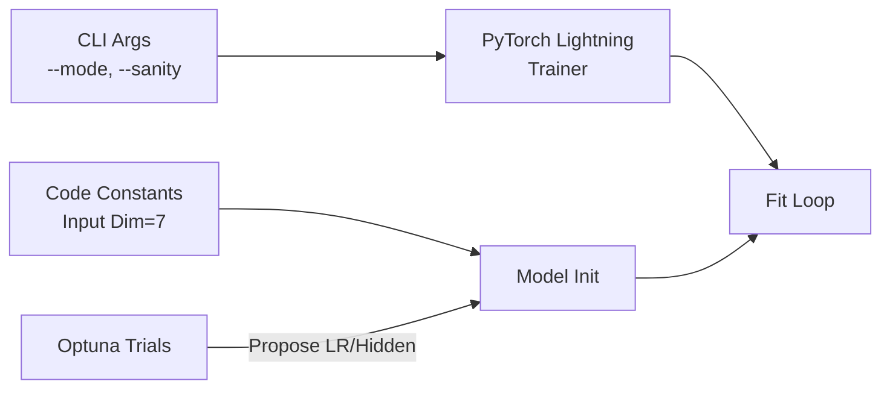

# Configuration & Hyperparameters

The NFL Analytics Engine is highly configurable via Command Line Arguments and internal constants.

## Command Line Interface (CLI)
The entry point `src/train.py` accepts the following flags:

| Argument | Default | Description |
| :--- | :--- | :--- |
| `--mode` | `train` | Operation mode. Options: `train` (Full Run), `tune` (Optuna Optimization). |
| `--sanity` | `False` | Flag. If present, runs a rapid "Sanity Check" on <500 frames to verify pipeline integrity. |

**Example**:
```bash
# Run in Hyperparameter Tuning mode
python -m src.train --mode tune
```

## Model Hyperparameters
Defined in `src/train.py` (LightningModule) and `src/models/gnn.py`.

| Parameter | Recommended | Description | Effect |
| :--- | :--- | :--- | :--- |
| `hidden_dim` | `64` | Size of internal node embeddings. | Higher = More capacity, Slower. |
| `heads` | `4` | Number of GATv2 Attention heads. | Controls multi-perspective reasoning. |
| `input_dim` | `7` | **Fixed**. (x, y, s, a, dir, o, w). | Changing this requires data re-engineering. |
| `context_dim`| `3` | **Fixed**. (Down, Dist, Box). | Global context vector size. |
| `future_seq_len` | `10` | **Fixed**. Number of future frames to predict (1.0s). | Prediction horizon. |

## Training Configuration

### Optimization
*   **Optimizer**: Adam
*   **Learning Rate**: `1e-3` (initially). Tunable via `optuna`.
*   **Loss Function**: Hybrid Weighted Loss.
    $$Loss = MSE_{traj} + 0.5 * BCE_{coverage}$$

### Data Loader Settings
*   **Radius**: `20.0` yards. (Max interaction distance for Graph Edges).
*   **Batch Size**: `32`. (Adjust based on GPU VRAM).

## Configuration Flow


