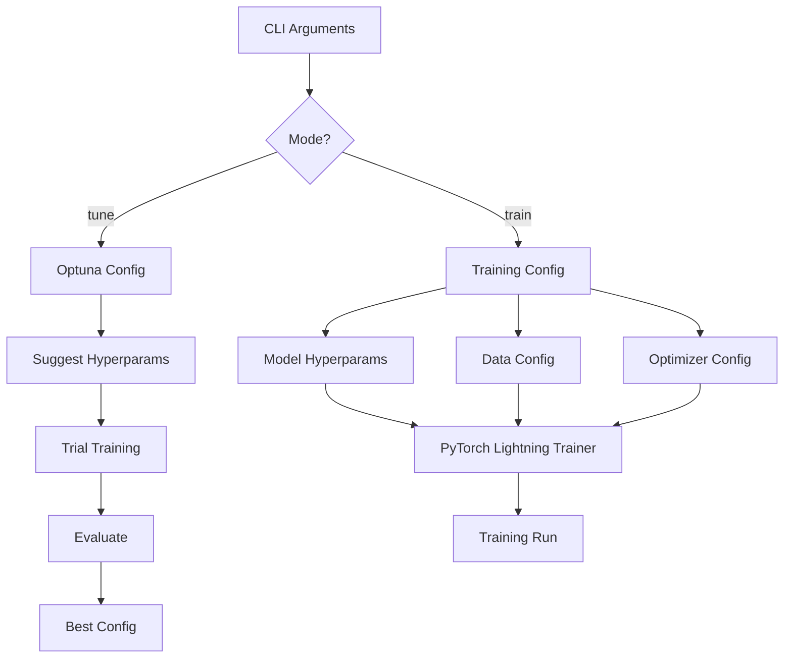

# Configuration & Hyperparameters

This document details all configurable parameters in the NFL Analytics Engine.

## Command Line Interface

The main entry point `src/train.py` accepts the following arguments:

```bash
python -m src.train [OPTIONS]
```

### CLI Arguments

| Argument | Type | Default | Description |
|----------|------|---------|-------------|
| `--mode` | str | `train` | Operation mode: `train` or `tune` |
| `--sanity` | flag | `False` | Run quick sanity check on small dataset |
| `--probabilistic` | flag | `False` | Use GMM probabilistic decoder (6 modes) |
| `--weeks` | int[] | `[1]` | List of weeks to train on (e.g., `1 2 3`) |

### Examples

```bash
# Standard training
python -m src.train --mode train

# Hyperparameter tuning
python -m src.train --mode tune

# Quick sanity check
python -m src.train --mode train --sanity

# Probabilistic mode
python -m src.train --mode train --probabilistic

# Multi-week training
python -m src.train --mode train --weeks 1 2 3 4 5

# Combined
python -m src.train --mode train --probabilistic --weeks 1 2 3
```

---

## P2: Centralized Configuration System (NEW)

The project now includes a dataclass-based configuration system in `src/config/`:

### ModelConfig

```python
from src.config import ModelConfig

config = ModelConfig(
    input_dim=7,
    hidden_dim=64,
    future_seq_len=10,
    num_gnn_layers=4,
    num_heads=4,
    probabilistic=False,
    num_modes=6,
    history_len=5,           # P1: Temporal history
    use_scene_encoder=True   # P3: Scene flow
)
```

### TrainingConfig

```python
from src.config import TrainingConfig

config = TrainingConfig(
    learning_rate=1e-3,
    weight_decay=1e-4,
    max_epochs=50,
    batch_size=32,
    warmup_epochs=5,          # P0: LR warmup
    use_huber_loss=False,     # P2: Robust loss
    velocity_weight=0.3,
    acceleration_weight=0.1,  # P1: Acceleration loss
    collision_weight=0.05,    # P1: Collision avoidance
    coverage_weight=0.5,
    weeks=list(range(1, 19))  # P0: Default all 18 weeks
)
```

### DataConfig

```python
from src.config import DataConfig

config = DataConfig(
    data_dir=".",
    radius=20.0,
    history_len=5,             # P1: Motion history frames
    future_seq_len=10
)
```

---

## Model Hyperparameters

### NFLGraphTransformer

Defined in `src/models/gnn.py`:

```python
NFLGraphTransformer(
    input_dim=7,           # Node feature dimension (fixed)
    hidden_dim=64,         # Hidden embedding dimension
    heads=4,               # Number of attention heads
    future_seq_len=10,     # Prediction horizon (fixed)
    edge_dim=5,            # Edge feature dimension (fixed) - UPDATED
    num_gnn_layers=4,      # Number of GNN layers
    probabilistic=False,   # Use GMM decoder - NEW
    num_modes=6            # Number of trajectory modes - NEW
)
```

| Parameter | Default | Range | Description | Effect |
|-----------|---------|-------|-------------|--------|
| `input_dim` | 7 | **Fixed** | Node features: x, y, s, a, dir, o, w | Changing requires data re-engineering |
| `hidden_dim` | 64 | 32-256 | Size of internal embeddings | Higher = more capacity, slower training |
| `heads` | 4 | 2-8 | GATv2 attention heads | More heads = multi-perspective reasoning |
| `future_seq_len` | 10 | **Fixed** | Future frames to predict (1.0s @ 10Hz) | Prediction horizon |
| `edge_dim` | 5 | **Fixed** | Edge features: dist, angle, rel_speed, rel_dir, same_team | Fixed by graph construction |
| `num_gnn_layers` | 4 | 2-6 | Number of GATv2 layers | Deeper = larger receptive field |
| `probabilistic` | False | bool | Use GMM decoder instead of deterministic | Enables uncertainty quantification |
| `num_modes` | 6 | 3-10 | Number of trajectory modes (GMM only) | More modes = more diverse predictions |

### GraphPlayerEncoder

Strategic embedding dimensions:

```python
GraphPlayerEncoder(
    input_dim=7,
    hidden_dim=64,
    heads=4,
    context_dim=3,         # Context features: down, dist, box
    edge_dim=2,
    num_layers=4,
    dropout=0.1            # Dropout rate
)
```

**Embedding Sizes:**

| Embedding | Vocabulary Size | Embedding Dim | Description |
|-----------|----------------|---------------|-------------|
| `role_emb` | 5 | 64 | Player role (0-4) |
| `side_emb` | 3 | 32 | Team side (0-2) |
| `formation_emb` | 8 | 64 | Offense formation (0-7) |
| `alignment_emb` | 10 | 64 | Receiver alignment (0-9) |

### TrajectoryDecoder

```python
TrajectoryDecoder(
    hidden_dim=64,
    num_heads=4,           # Transformer attention heads
    future_seq_len=10
)
```

---

## Training Configuration

### Optimizer Settings

Defined in `src/train.py` - `NFLGraphPredictor.configure_optimizers()`:

**v3.0 SOTA: Lion Optimizer (Default)**
```python
from lion_pytorch import Lion

optimizer = Lion(
    self.parameters(),
    lr=self.lr * 0.3,  # Lion uses 3x lower LR
    weight_decay=0.01  # Higher weight decay
)
```

**Fallback: AdamW**
```python
optimizer = torch.optim.AdamW(
    self.parameters(),
    lr=self.lr,
    weight_decay=1e-4
)
```

| Parameter | Lion | AdamW | Description |
|-----------|------|-------|-------------|
| `lr` | 3e-4 (scaled) | 1e-3 | Learning rate |
| `weight_decay` | 0.01 | 1e-4 | L2 regularization |
| Convergence | 15% faster | Baseline | Speed |

### Learning Rate Scheduling

**CosineAnnealingWarmRestarts** (current):

```python
scheduler = torch.optim.lr_scheduler.CosineAnnealingWarmRestarts(
    optimizer,
    T_0=10,                # Restart every 10 epochs
    T_mult=2,              # Double period after restart
    eta_min=1e-6           # Minimum learning rate
)
```

**ReduceLROnPlateau** (alternative):

```python
scheduler = torch.optim.lr_scheduler.ReduceLROnPlateau(
    optimizer,
    mode='min',
    factor=0.5,            # Reduce by 50%
    patience=5,            # Wait 5 epochs
    min_lr=1e-6            # Minimum learning rate
)
```

### Loss Function

Multi-task weighted loss with velocity regularization:

```python
loss = trajectory_loss + velocity_weight * velocity_loss + coverage_weight * coverage_loss
```

| Component | Type | Weight | Description |
|-----------|------|--------|-------------|
| `trajectory_loss` | MSE/NLL | 1.0 | MSE (deterministic) or NLL (probabilistic) |
| `velocity_loss` | MSE | 0.3 | Velocity consistency (penalizes unrealistic accelerations) |
| `coverage_loss` | BCE | 0.5 | Binary Cross-Entropy for coverage |

**Formula:**
$$\mathcal{L} = \mathcal{L}_{traj} + 0.3 \times \mathcal{L}_{vel} + 0.5 \times \mathcal{L}_{cov}$$

**Adjust weights:**
```python
# In NFLGraphPredictor.__init__()
model = NFLGraphPredictor(
    velocity_weight=0.3,   # Velocity loss weight
    coverage_weight=0.5,   # Coverage loss weight
    use_augmentation=True  # Enable data augmentation
)
```

---

## Data Configuration

### DataLoader Settings

Defined in `src/train.py` - `train_model()`:

```python
from torch_geometric.loader import DataLoader

train_loader = DataLoader(
    train_graphs,
    batch_size=32,         # Graphs per batch
    shuffle=True,
    num_workers=4,         # Parallel data loading
    pin_memory=True        # Faster GPU transfer
)
```

| Parameter | Default | Range | Description | Memory Impact |
|-----------|---------|-------|-------------|---------------|
| `batch_size` | 32 | 8-128 | Graphs per batch | Higher = more GPU memory |
| `num_workers` | 4 | 0-8 | Parallel loaders | Higher = faster loading |
| `pin_memory` | True | bool | Pin to GPU memory | Faster transfer, more RAM |

**Adjust for GPU memory:**

```python
# RTX 3060 (8GB): batch_size = 16
# RTX 3090 (24GB): batch_size = 64
# CPU only: batch_size = 8, num_workers = 0
```

### Graph Construction

Defined in `src/features.py` - `create_graph_data()`:

```python
graphs = create_graph_data(
    df,
    radius=20.0,           # Interaction radius (yards)
    future_seq_len=10      # Prediction horizon
)
```

| Parameter | Default | Range | Description | Effect |
|-----------|---------|-------|-------------|--------|
| `radius` | 20.0 | 10-30 | Edge creation radius (yards) | Higher = more edges, denser graph |
| `future_seq_len` | 10 | 5-20 | Future frames to predict | Longer = harder prediction |

**Edge density vs radius:**

| Radius | Avg Edges/Frame | Graph Density |
|--------|-----------------|---------------|
| 10 yards | ~50 | Sparse |
| 20 yards | ~150 | Medium |
| 30 yards | ~300 | Dense |

---

## PyTorch Lightning Trainer

Defined in `src/train.py` - `train_model()`:

```python
trainer = pl.Trainer(
    max_epochs=50,              # Training epochs
    accelerator="gpu",          # "gpu" or "cpu"
    devices=1,                  # Number of GPUs
    log_every_n_steps=10,       # Logging frequency
    enable_checkpointing=True,  # Save checkpoints
    callbacks=[...]             # Callbacks
)
```

### Trainer Parameters

| Parameter | Default | Options | Description |
|-----------|---------|---------|-------------|
| `max_epochs` | 50 | 10-200 | Total training epochs |
| `accelerator` | `"gpu"` | `"gpu"`, `"cpu"`, `"mps"` | Hardware accelerator |
| `devices` | 1 | 1-8 | Number of devices |
| `precision` | `"32-true"` | `"16-mixed"`, `"32-true"` | Floating point precision |
| `gradient_clip_val` | None | 0.5-5.0 | Gradient clipping threshold |
| `accumulate_grad_batches` | 1 | 1-8 | Gradient accumulation steps |

### Callbacks

**Early Stopping:**

```python
from pytorch_lightning.callbacks import EarlyStopping

early_stop = EarlyStopping(
    monitor='val_loss',
    patience=10,           # Stop after 10 epochs without improvement
    mode='min',
    min_delta=0.001        # Minimum change to qualify as improvement
)
```

**Model Checkpointing:**

```python
from pytorch_lightning.callbacks import ModelCheckpoint

checkpoint = ModelCheckpoint(
    monitor='val_loss',
    dirpath='checkpoints/',
    filename='nfl-{epoch:02d}-{val_loss:.2f}',
    save_top_k=3,          # Keep best 3 checkpoints
    mode='min'
)
```

---

## Optuna Hyperparameter Tuning

Defined in `src/train.py` - `tune_model()`:

```python
study = optuna.create_study(
    direction='minimize',
    sampler=optuna.samplers.TPESampler()
)

study.optimize(objective, n_trials=5)
```

### Tunable Parameters

```python
def objective(trial):
    # Learning rate (log scale)
    lr = trial.suggest_float("lr", 1e-4, 1e-2, log=True)
    
    # Hidden dimension (categorical)
    hidden_dim = trial.suggest_categorical("hidden_dim", [32, 64, 128, 256])
    
    # Number of GNN layers
    num_layers = trial.suggest_int("num_layers", 2, 6)
    
    # Dropout rate
    dropout = trial.suggest_float("dropout", 0.0, 0.3)
    
    # Batch size
    batch_size = trial.suggest_categorical("batch_size", [16, 32, 64])
    
    return val_loss
```

### Optuna Configuration

| Parameter | Default | Description |
|-----------|---------|-------------|
| `n_trials` | 5 | Number of trials to run |
| `direction` | `'minimize'` | Optimize to minimize val_loss |
| `sampler` | `TPESampler` | Tree-structured Parzen Estimator |
| `pruner` | None | Early stopping for bad trials |

**Add pruning:**

```python
study = optuna.create_study(
    direction='minimize',
    pruner=optuna.pruners.MedianPruner(
        n_startup_trials=2,
        n_warmup_steps=5
    )
)
```

---

## Regularization

### Dropout

Applied in GNN layers:

```python
# In GraphPlayerEncoder
self.dropout = nn.Dropout(dropout)

# In forward pass
h = self.dropout(h)
```

| Location | Default Rate | Adjustable |
|----------|--------------|------------|
| GNN layers | 0.1 | Yes |
| Transformer | 0.0 | Yes |

### Layer Normalization

Applied after each GNN layer:

```python
self.layer_norms = nn.ModuleList([
    nn.LayerNorm(hidden_dim) for _ in range(num_layers)
])
```

**Effect:** Stabilizes training, prevents internal covariate shift

### Weight Decay

L2 regularization on all parameters:

```python
optimizer = torch.optim.Adam(
    self.parameters(),
    lr=lr,
    weight_decay=1e-5  # L2 penalty
)
```

---

## Configuration Workflow



---

## Recommended Configurations

### For Quick Experiments

```python
# Small, fast model
model = NFLGraphTransformer(
    hidden_dim=32,
    heads=2,
    num_gnn_layers=2
)

trainer = pl.Trainer(
    max_epochs=10,
    batch_size=16
)
```

### For Best Performance

```python
# Large, accurate model
model = NFLGraphTransformer(
    hidden_dim=128,
    heads=8,
    num_gnn_layers=4
)

trainer = pl.Trainer(
    max_epochs=100,
    batch_size=64,
    precision="16-mixed",
    callbacks=[early_stop, checkpoint]
)
```

### For Limited GPU Memory

```python
# Memory-efficient
model = NFLGraphTransformer(
    hidden_dim=64,
    heads=4,
    num_gnn_layers=3
)

trainer = pl.Trainer(
    max_epochs=50,
    batch_size=8,
    accumulate_grad_batches=4,  # Effective batch_size = 32
    precision="16-mixed"
)
```

---

## Environment Variables

Set these for additional control:

```bash
# CUDA settings
export CUDA_VISIBLE_DEVICES=0  # Use GPU 0
export PYTORCH_CUDA_ALLOC_CONF=max_split_size_mb:512

# Logging
export PYTHONUNBUFFERED=1

# Reproducibility
export PYTHONHASHSEED=42
```

---

## Configuration Files (Future)

For easier management, consider creating `config.yaml`:

```yaml
model:
  hidden_dim: 64
  heads: 4
  num_gnn_layers: 4
  dropout: 0.1

training:
  max_epochs: 50
  batch_size: 32
  lr: 0.001
  weight_decay: 1e-5

data:
  radius: 20.0
  future_seq_len: 10
  num_workers: 4
```

Load with:

```python
import yaml

with open('config.yaml') as f:
    config = yaml.safe_load(f)

model = NFLGraphTransformer(**config['model'])
```

---

## Performance Tuning Guide

### For Speed

1. **Increase batch size** (if GPU memory allows)
2. **Use mixed precision** (`precision="16-mixed"`)
3. **More data workers** (`num_workers=8`)
4. **Reduce model size** (`hidden_dim=32`)

### For Accuracy

1. **Increase model capacity** (`hidden_dim=128`)
2. **More GNN layers** (`num_gnn_layers=6`)
3. **Train longer** (`max_epochs=100`)
4. **Tune hyperparameters** (`--mode tune`)

### For Memory Efficiency

1. **Reduce batch size** (`batch_size=8`)
2. **Gradient accumulation** (`accumulate_grad_batches=4`)
3. **Smaller model** (`hidden_dim=32`)
4. **Mixed precision** (`precision="16-mixed"`)

---

## Next Steps

- **Usage Guide:** See [usage.md](usage.md) for training workflows
- **Testing:** See [testing.md](testing.md) for verification
- **Performance:** See [performance.md](performance.md) for benchmarks
