# Configuration Guide

> Complete reference for all hyperparameters and training settings.

## 📁 Configuration Files


---

## 🎯 Maximum Parameters Configuration

The recommended config for competition-winning results:


### Full Configuration

```yaml
# configs/max_accuracy_rtx3050.yaml

experiment_name: "nfl_max_parameters"

# Data
weeks: [1-18]              # All data
radius: 30.0               # Maximum context
future_seq_len: 10         # 1 second prediction

# Model (12M parameters)
hidden_dim: 384            # 1.5× default
num_gnn_layers: 8          # Deep network
heads: 12                  # Multi-head attention
num_modes: 16              # Maximum multi-modal
dropout: 0.08
droppath_rate: 0.18

# Training
batch_size: 16
accumulate_grad_batches: 12  # Effective: 192
learning_rate: 0.00008
max_epochs: 200
weight_decay: 0.08
```

---

## 📊 Parameter Reference

### Model Architecture

```mermaid
flowchart LR
    subgraph Size["Model Size Impact"]
        S1["hidden_dim↑"] --> P1["Params ↑↑"]
        S2["num_layers↑"] --> P2["Params ↑"]
        S3["heads↑"] --> P3["Minimal"]
        S4["num_modes↑"] --> P4["Params ↑"]
    end
```



| Parameter | Min | Default | Max (4GB) | Impact |
|-----------|-----|---------|-----------|--------|
| `hidden_dim` | 64 | 256 | **384** | Quadratic |
| `num_gnn_layers` | 2 | 6 | **8** | Linear |
| `heads` | 2 | 8 | **12** | Minimal |
| `num_modes` | 1 | 8 | **16** | Linear |
| `dropout` | 0.0 | 0.1 | 0.2 | N/A |
| `droppath_rate` | 0.0 | 0.12 | **0.18** | N/A |

### Training Settings

| Parameter | Range | Recommended | Notes |
|-----------|-------|-------------|-------|
| `batch_size` | 8-64 | **16** | Lower for large model |
| `accumulate_grad_batches` | 1-16 | **12** | Effective batch = 192 |
| `learning_rate` | 1e-5 to 1e-3 | **8e-5** | Lower for large model |
| `weight_decay` | 0.01-0.1 | **0.08** | Stronger for large model |
| `max_epochs` | 50-300 | **200** | Long training |
| `warmup_epochs` | 5-20 | **15** | Longer for stability |

---

## 🎯 Loss Weight Configuration


### Loss Tuning Guide

| Loss | ↓ When | ↑ When |
|------|--------|--------|
| `trajectory_weight` | Overfitting | Underfitting |
| `velocity_weight` | Jerky motion | Too smooth |
| `social_nce_weight` | Collisions ok | Social modeling |
| `wta_weight` | Mode collapse | Multi-modal |
| `diversity_weight` | Modes similar | Memory issues |
| `endpoint_focal_weight` | FDE ok | FDE too high |

---

## ⚡ Hardware Settings

```mermaid
flowchart LR
    subgraph GPU["GPU Optimization"]
        G1["precision: 16-mixed"]
        G2["benchmark: true"]
        G3["Tensor Cores: ON"]
    end
    
    subgraph Memory["Memory Management"]
        M1["batch_size: 16"]
        M2["gradient_clip: 0.25"]
        M3["cache_size: 100"]
    end
    
    GPU --> Performance["2× Faster"]
    Memory --> Fits["Fits 4GB"]
```



### RTX 3050 4GB Settings

```yaml
# Hardware
precision: "16-mixed"       # Tensor Cores
accelerator: "gpu"
benchmark: true             # cuDNN autotuning
num_workers: 0              # Pre-cached graphs

# Memory
batch_size: 16              # Fits with 16 modes
in_memory_cache_size: 100   # RAM cache
gradient_clip_val: 0.25     # Stability
```

---

## 🔄 Callback Configuration


### Callback Settings

```yaml
# Early Stopping
early_stopping_patience: 30
early_stopping_min_delta: 0.00002
monitor_metric: "val_minADE"

# Checkpointing
save_top_k: 15
save_last: true

# SWA
swa_enabled: true
swa_epoch_start: 0.65       # Start at 65%
swa_lrs: 5e-7
swa_annealing_epochs: 20
```

---

## 🎮 CLI Usage

### Training Commands

```bash
# Maximum parameters (competition)
python finetune_best_model.py --config configs/max_accuracy_rtx3050.yaml

# Quick test
python finetune_best_model.py --config configs/sanity.yaml

# Custom config
python finetune_best_model.py --config my_config.yaml
```

### Monitoring

```bash
# GPU usage
watch -n 1 nvidia-smi

# TensorBoard
tensorboard --logdir lightning_logs/
```

---

## 📈 Tuning Recommendations

### For Lower minADE


### For Lower FDE


### For Faster Training


---

## 🧪 Debug Settings

```yaml
# For debugging only
fast_dev_run: true          # Single batch
limit_train_batches: 10
detect_anomaly: true        # NaN detection
log_every_n_steps: 1
```
