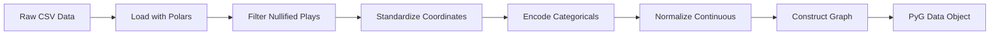

# Data Dictionary

This document provides a complete reference for all features, encodings, and data structures used in the NFL Analytics Engine.

## Feature Categories

1. **Node Features** - Per-player attributes at each frame
2. **Edge Features** - Pairwise relationships between players
3. **Context Features** - Play-level game state
4. **Strategic Features** - Formation and tactical information
5. **Target Variables** - Prediction outputs

---

## 1. Node Features (Tracking Data)

These features exist for **every player** (and the ball) at **every frame** (10 Hz sampling).

| Feature | Type | Source | Range | Description | Normalization |
|---------|------|--------|-------|-------------|---------------|
| `std_x` | Float32 | Tracking | 0-120 | X coordinate (field length in yards) | Standardized left-to-right |
| `std_y` | Float32 | Tracking | 0-53.3 | Y coordinate (field width in yards) | Standardized left-to-right |
| `s` | Float32 | Tracking | 0-25 | Speed (yards/second) | Raw |
| `a` | Float32 | Tracking | -10 to 10 | Acceleration (yards/sec²) | Raw |
| `std_dir` | Float32 | Tracking | 0-360 | Motion direction (degrees) | Standardized |
| `std_o` | Float32 | Tracking | 0-360 | Player orientation (degrees) | Standardized |
| `weight_norm` | Float32 | Roster | ~-2 to 3 | Normalized player weight | `(w - 200) / 50` |

**Node Feature Vector Shape:** `[Total_Nodes, 7]`

### Coordinate System

```
    0 yards                                                120 yards
    ┌─────────────────────────────────────────────────────────┐
    │  Endzone  │                                  │  Endzone  │
    │           │                                  │           │
    │           │          Playing Field           │           │
    │           │                                  │           │
    │  Endzone  │                                  │  Endzone  │
    └─────────────────────────────────────────────────────────┘
    0 yds                                                  53.3 yds
    
    After standardization: Offense always attacks RIGHT (→)
```

### Role ID Mapping

Strategic role of each player in the play.

| Role ID | Role Name | Description | Example Positions |
|---------|-----------|-------------|-------------------|
| 0 | Defensive Coverage | Defenders in pass coverage | CB, S, LB |
| 1 | Other Route Runner | Non-targeted receivers | WR, TE, RB |
| 2 | Passer | Quarterback | QB |
| 3 | Targeted Receiver | Primary target on play | WR, TE |
| 4 | Unknown/Ball | Ball or unclassified | Football |

**Embedding:** `nn.Embedding(5, 64)` → 64-dimensional vector

### Side ID Mapping

Team assignment for each player.

| Side ID | Side Name | Description |
|---------|-----------|-------------|
| 0 | Defense | Defensive team |
| 1 | Offense | Offensive team |
| 2 | Unknown | Ball or special teams |

**Embedding:** `nn.Embedding(3, 32)` → 32-dimensional vector (padded to 64)

---

## 2. Edge Features

Edge features capture pairwise relationships between players within the interaction radius.

| Feature | Type | Range | Description | Computation |
|---------|------|-------|-------------|-------------|
| `distance` | Float32 | 0-20 | Euclidean distance (yards) | $\sqrt{(x_i - x_j)^2 + (y_i - y_j)^2}$ |
| `angle` | Float32 | -π to π | Relative angle (radians) | $\arctan2(y_j - y_i, x_j - x_i)$ |
| `rel_speed` | Float32 | -25 to 25 | Relative speed difference | $s_j - s_i$ |
| `rel_dir` | Float32 | -π to π | Relative direction difference | $\text{angle\_diff}(dir_j, dir_i)$ |
| `same_team` | Float32 | 0 or 1 | Same team indicator | $1$ if same team, $0$ otherwise |

**Edge Attribute Shape:** `[Num_Edges, 5]`

### Edge Construction

- **Method:** Radius graph
- **Radius:** 20.0 yards
- **Self-loops:** Disabled
- **Max neighbors:** 32 (for efficiency)

**Example:**
```python
# Player at (50, 26) can connect to players within 20 yards
# Typical frame: ~100-200 edges for 22 players
```

---

## 3. Context Features (Play Level)

These features are constant for the entire play and represent game state.

| Feature | Type | Source | Range | Description | Encoding |
|---------|------|--------|-------|-------------|----------|
| `down` | Int64 | Plays | 1-4 | Current down | Raw (1-4) |
| `yards_to_go` | Int64 | Plays | 1-99 | Yards to first down | Raw |
| `defenders_box_norm` | Float32 | Plays | ~-2 to 2 | Normalized defenders in box | `(N - 7) / 2` |

**Context Vector Shape:** `[Batch_Size, 3]`

### Context Normalization

**Defenders in Box:**
- **Raw range:** 4-11 defenders
- **Typical value:** 7 defenders
- **Normalization:** $(box - 7) / 2$
- **Normalized range:** Approximately -1.5 to 2.0

---

## 4. Strategic Features (Play Level)

High-level tactical information encoded as categorical embeddings.

### 4.1 Offense Formation (`formation_id`)

Offensive formation at snap.

| Formation ID | Formation Name | Description |
|--------------|----------------|-------------|
| 0 | SHOTGUN | QB in shotgun (5-7 yards back) |
| 1 | EMPTY | No RB in backfield |
| 2 | SINGLEBACK | One RB behind QB |
| 3 | PISTOL | QB 3-4 yards back, RB behind |
| 4 | I_FORM | Two RBs in line behind QB |
| 5 | JUMBO | Heavy formation (extra linemen) |
| 6 | WILDCAT | Direct snap to non-QB |
| 7 | Unknown | Missing or unclassified |

**Source:** `offense_formation` column  
**Embedding:** `nn.Embedding(8, 64)` → 64-dimensional vector

### 4.2 Receiver Alignment (`alignment_id`)

Distribution of receivers on the field.

| Alignment ID | Alignment Name | Description |
|--------------|----------------|-------------|
| 0 | 2x2 | 2 receivers on each side |
| 1 | 3x1 | 3 receivers one side, 1 other |
| 2 | 3x2 | 3 receivers one side, 2 other |
| 3 | 2x1 | 2 receivers one side, 1 other |
| 4 | 4x1 | 4 receivers one side, 1 other |
| 5 | 1x1 | 1 receiver each side |
| 6 | 4x0 | All 4 receivers on one side |
| 7 | 3x3 | 3 receivers each side (rare) |
| 8 | 3x0 | All 3 receivers on one side |
| 9 | Unknown | Missing or unclassified |

**Source:** `receiver_alignment` column  
**Embedding:** `nn.Embedding(10, 64)` → 64-dimensional vector

---

## 5. Target Variables (Outputs)

### 5.1 Trajectory (`y`)

Future player positions for the next 1.0 second.

**Shape:** `[Num_Nodes, 10, 2]`
- **Num_Nodes:** All players in the batch
- **10:** Future frames (t+1 to t+10)
- **2:** (x, y) coordinates

**Content:** Standardized `(std_x, std_y)` coordinates

**Loss Function:** Mean Squared Error (MSE)
$$\mathcal{L}_{traj} = \frac{1}{N \times 10} \sum_{i=1}^{N} \sum_{t=1}^{10} \|\hat{y}_{i,t} - y_{i,t}\|^2$$

### 5.2 Coverage (`y_coverage`)

Defensive coverage scheme classification.

**Type:** Binary classification  
**Shape:** `[Batch_Size]`

| Label | Coverage Type | Description |
|-------|---------------|-------------|
| 0 | Man Coverage | Each defender assigned to specific receiver |
| 1 | Zone Coverage | Defenders cover field areas |

**Source:** `team_coverage_man_zone` column  
**Loss Function:** Binary Cross-Entropy with Logits (BCE)
$$\mathcal{L}_{cov} = -\frac{1}{B} \sum_{i=1}^{B} [y_i \log(\sigma(\hat{y}_i)) + (1-y_i) \log(1-\sigma(\hat{y}_i))]$$

---

## Complete Data Object Structure

### PyG Data Object

```python
Data(
    # Node features [N, 7]
    x=torch.tensor([
        [std_x, std_y, s, a, std_dir, std_o, weight_norm],
        ...
    ]),
    
    # Edge connectivity [2, E]
    edge_index=torch.tensor([
        [src_node_ids...],
        [tgt_node_ids...]
    ]),
    
    # Edge attributes [E, 2]
    edge_attr=torch.tensor([
        [distance, angle],
        ...
    ]),
    
    # Target trajectory [N, 10, 2]
    y=torch.tensor([
        [[x1, y1], [x2, y2], ..., [x10, y10]],
        ...
    ]),
    
    # Strategic node features [N]
    role=torch.tensor([0, 1, 2, 3, 0, ...]),
    side=torch.tensor([0, 1, 1, 1, 0, ...]),
    
    # Strategic graph features [1]
    formation=torch.tensor([0]),  # SHOTGUN
    alignment=torch.tensor([1]),  # 3x1
    
    # Context features [1, 3]
    context=torch.tensor([[down, yards_to_go, defenders_box_norm]]),
    
    # Coverage label [1]
    y_coverage=torch.tensor([1]),  # Zone coverage
    
    # Batch assignment [N]
    batch=torch.tensor([0, 0, 0, ..., 0]),  # All nodes in graph 0
)
```

---

## Data Type Summary

| Category | Feature | Data Type | Shape | Device |
|----------|---------|-----------|-------|--------|
| **Input** | x | Float32 | [N, 7] | GPU/CPU |
| | edge_index | Int64 | [2, E] | GPU/CPU |
| | edge_attr | Float32 | [E, 2] | GPU/CPU |
| | role | Int64 | [N] | GPU/CPU |
| | side | Int64 | [N] | GPU/CPU |
| | formation | Int64 | [B] | GPU/CPU |
| | alignment | Int64 | [B] | GPU/CPU |
| | context | Float32 | [B, 3] | GPU/CPU |
| | batch | Int64 | [N] | GPU/CPU |
| **Target** | y | Float32 | [N, 10, 2] | GPU/CPU |
| | y_coverage | Int64 | [B] | GPU/CPU |

**Legend:**
- N = Total nodes in batch
- E = Total edges in batch
- B = Batch size (number of graphs)

---

## Feature Engineering Pipeline



---

## Validation Rules

### Data Quality Checks

1. **Coordinate Bounds:**
   - `0 ≤ std_x ≤ 120`
   - `0 ≤ std_y ≤ 53.3`

2. **Speed Sanity:**
   - `0 ≤ s ≤ 25` (max human speed ~23 mph ≈ 10 m/s ≈ 22 yards/s)

3. **Angle Ranges:**
   - `0 ≤ std_dir ≤ 360`
   - `0 ≤ std_o ≤ 360`

4. **Player Count:**
   - Typical: 22 players + 1 ball = 23 nodes per frame
   - Range: 20-25 (accounts for substitutions)

5. **Edge Count:**
   - Typical: 100-200 edges per frame
   - Depends on player clustering

### Missing Value Handling

| Feature | Missing Value Strategy |
|---------|------------------------|
| `defenders_in_the_box` | Fill with 7.0 (typical value) |
| `offense_formation` | Map to ID 7 (Unknown) |
| `receiver_alignment` | Map to ID 9 (Unknown) |
| `player_role` | Map to ID 4 (Unknown) |
| `player_weight` | Use position average or 200 lbs |

---

## Usage Examples

### Accessing Features

```python
# Load a batch
for batch in dataloader:
    # Node features
    positions = batch.x[:, :2]  # [N, 2] - x, y
    velocities = batch.x[:, 2]  # [N] - speed
    
    # Strategic features
    roles = batch.role  # [N]
    formations = batch.formation  # [B]
    
    # Context
    down = batch.context[:, 0]  # [B]
    
    # Targets
    future_traj = batch.y  # [N, 10, 2]
    coverage = batch.y_coverage  # [B]
```

### Feature Statistics

```python
import polars as pl

# Load data
df = loader.load_week_data(1)

# Compute statistics
stats = df.select([
    pl.col("s").mean().alias("avg_speed"),
    pl.col("s").std().alias("std_speed"),
    pl.col("a").mean().alias("avg_accel"),
    pl.col("weight_norm").mean().alias("avg_weight_norm"),
])

print(stats)
```

---

## Advanced Metrics

Beyond basic features, the system computes advanced metrics:

### Zone Collapse Speed

Rate of change of defensive convex hull area.

**Formula:**
$$\text{Collapse Speed} = \frac{d(\text{Hull Area})}{dt}$$

**Units:** Square yards per second

### Defensive Reaction Time

Average time for defenders to react after ball release.

**Computation:**
1. Detect ball release frame
2. Measure time to peak acceleration change (jerk)
3. Average across all defenders

**Units:** Seconds

---

## References

- **NFL Big Data Bowl:** [kaggle.com/c/nfl-big-data-bowl-2026](https://www.kaggle.com/c/nfl-big-data-bowl-2026)
- **Tracking Data Specification:** NFL Next Gen Stats documentation
- **PyTorch Geometric:** [pytorch-geometric.readthedocs.io](https://pytorch-geometric.readthedocs.io)
