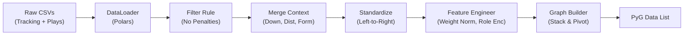

# Data Pipeline

This document details the exact flow of data from raw CSVs to the PyTorch Geometric Data objects consumed by the model.

## Pipeline Overview

## Detailed Steps

### 1. Ingestion (`src/data_loader.py`)
*   **Source**: `train/input_week_*.csv` and `supplementary_data.csv`.
*   **Context Merging**:
    *   Game state (`down`, `yards_to_go`) and Strategy (`offense_formation`) are joined from the plays file to the tracking file using `game_id` and `play_id`.
    *   **Nullified Plays**: Plays with `play_nullified_by_penalty == 'Y'` are dropped immediately to avoid training on invalid logic.

### 2. Standardization
*   **Goal**: Ensure all coordinates ($x, y$) and directions represent the offense moving **Left to Right**.
*   **Logic**:
    *   If `play_direction == 'left'`:
        *   $x \leftarrow 120 - x$
        *   $y \leftarrow 53.3 - y$
        *   $dir \leftarrow (dir + 180) \mod 360$

### 3. Feature Engineering (`src/features.py`)
*   **Normalization**:
    *   `Player Weight`: $w_{norm} = (w - 200) / 50$
    *   `Defenders in Box`: $box_{norm} = (box - 7) / 2$
*   **Encoding**:
    *   Categorical strings (`SHOTGUN`, `CB`) are mapped to integers using fixed dictionaries defined in `DataLoader`.

### 4. Graph Construction
*   **Input**: A standardized DataFrame containing multiple plays.
*   **Process**:
    1.  **Partition**: Group data by `(game_id, play_id)`.
    2.  **Pivot**: Convert `[Frames*Agents, Feats]` (Long format) to `[Frames, Agents, Feats]` (Tensor format).
    3.  **Sliding Window**:
        *   Extract window $t$ as Input $X$.
        *   Extract window $t+1 \dots t+10$ as Target $Y$.
    4.  **Edge Creation**:
        *   Compute pairwise Euclidean distance matrix.
        *   Create edges where $dist < 20$ yards (Radius Graph).
        *   Compute Edge Attributes: `[Distance, Relative Angle]`.

### 5. Data Objects
The final output is a list of `torch_geometric.data.Data` objects:
*   `x`: Node features.
*   `edge_index`: Adjacency list.
*   `edge_attr`: Edge features.
*   `y`: Target trajectory.
*   `role`/`formation`/`alignment`: Strategic Integer IDs.
*   `context`: Global continuous context.
