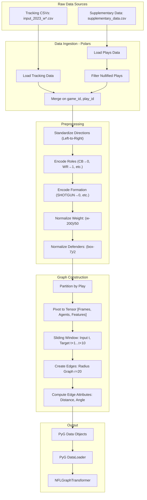

# Data Pipeline

This document details the complete data flow from raw CSV files to PyTorch Geometric `Data` objects consumed by the model.

## Pipeline Overview



## Detailed Pipeline Steps

### 1. Data Ingestion (`src/data_loader.py`)

#### 1.1 Load Tracking Data

**Source Files:** `train/input_2023_w{week:02d}.csv`

**Key Columns:**
- `game_id`, `play_id`: Unique identifiers
- `nfl_id`: Player identifier
- `frame_id`: Frame number (10 Hz sampling)
- `x`, `y`: Field coordinates
- `s`, `a`: Speed and acceleration
- `dir`, `o`: Direction and orientation (degrees)
- `player_role`: Tactical role (e.g., "Defensive Coverage")
- `player_side`: "Defense" or "Offense"
- `player_weight`: Player weight in pounds

**Implementation:**
```python
class DataLoader:
    def load_week_data(self, week: int) -> pl.DataFrame:
        # Load tracking CSV with Polars
        tracking_df = pl.read_csv(f"train/input_2023_w{week:02d}.csv")
        
        # Load plays for context
        plays_df = self.load_plays()
        
        # Filter nullified plays (NFL Rule)
        valid_plays = plays_df.filter(
            pl.col("play_nullified_by_penalty") == "N"
        )
        
        # Join tracking with play context
        df = tracking_df.join(valid_plays, on=["game_id", "play_id"])
        
        return df
```

#### 1.2 Load Supplementary Data

**Source File:** `supplementary_data.csv`

**Key Columns:**
- `game_id`, `play_id`: Identifiers
- `down`, `yards_to_go`: Game state
- `absolute_yardline_number`: Field position
- `possession_team`: Team with ball
- `team_coverage_man_zone`: Coverage type ("MAN_COVERAGE" or "ZONE_COVERAGE")
- `offense_formation`: Formation (e.g., "SHOTGUN", "EMPTY")
- `receiver_alignment`: Alignment (e.g., "2x2", "3x1")
- `defenders_in_the_box`: Number of defenders in box

#### 1.3 NFL Rule Enforcement

**Critical Filter:**
```python
valid_plays = plays_df.filter(
    pl.col("play_nullified_by_penalty") == "N"
)
```

This ensures we only train on valid plays, avoiding learning from penalized actions.

### 2. Standardization

#### 2.1 Coordinate Standardization

**Goal:** Ensure all plays move **left to right** (offense attacking right endzone)

**Logic:**
```python
def standardize_tracking_directions(df: pl.DataFrame) -> pl.DataFrame:
    return df.with_columns([
        # X coordinate
        pl.when(pl.col('play_direction') == 'left')
          .then(120 - pl.col('x'))
          .otherwise(pl.col('x'))
          .alias('std_x'),
        
        # Y coordinate
        pl.when(pl.col('play_direction') == 'left')
          .then(53.3 - pl.col('y'))
          .otherwise(pl.col('y'))
          .alias('std_y'),
        
        # Orientation
        pl.when(pl.col('play_direction') == 'left')
          .then((pl.col('o') + 180).mod(360))
          .otherwise(pl.col('o'))
          .alias('std_o'),
        
        # Direction
        pl.when(pl.col('play_direction') == 'left')
          .then((pl.col('dir') + 180).mod(360))
          .otherwise(pl.col('dir'))
          .alias('std_dir'),
    ])
```

**Transformations:**
- If `play_direction == 'left'`:
  - $x_{std} = 120 - x$
  - $y_{std} = 53.3 - y$
  - $dir_{std} = (dir + 180) \mod 360$
  - $o_{std} = (o + 180) \mod 360$

### 3. Feature Engineering

#### 3.1 Categorical Encoding

**Role Mapping:**
```python
role_map = {
    "Defensive Coverage": 0,  # CB, S, LB in coverage
    "Other Route Runner": 1,   # WR, TE, RB
    "Passer": 2,               # QB
    "Targeted Receiver": 3,    # Primary target
    # Default: 4 (Unknown/Ball)
}
```

**Formation Mapping:**
```python
formation_map = {
    "SHOTGUN": 0,
    "EMPTY": 1,
    "SINGLEBACK": 2,
    "PISTOL": 3,
    "I_FORM": 4,
    "JUMBO": 5,
    "WILDCAT": 6,
    # Default: 7 (Unknown)
}
```

**Alignment Mapping:**
```python
alignment_map = {
    "2x2": 0,  # 2 receivers each side
    "3x1": 1,  # 3 receivers one side, 1 other
    "3x2": 2,
    "2x1": 3,
    "4x1": 4,
    "1x1": 5,
    "4x0": 6,
    "3x3": 7,
    "3x0": 8,
    # Default: 9 (Unknown)
}
```

**Side Mapping:**
```python
side_map = {
    "Defense": 0,
    "Offense": 1,
    # Default: 2 (Unknown)
}
```

**Coverage Mapping:**
```python
coverage_map = {
    "MAN_COVERAGE": 0,
    "ZONE_COVERAGE": 1,
}
```

#### 3.2 Continuous Feature Normalization

**Weight Normalization:**
$$w_{norm} = \frac{w - 200}{50}$$

Centers around 200 lbs (typical player weight) with scale of 50 lbs.

**Defenders in Box Normalization:**
$$box_{norm} = \frac{box - 7}{2}$$

Centers around 7 defenders (typical) with scale of 2.

**Implementation:**
```python
df = df.with_columns([
    # Weight normalization
    ((pl.col("player_weight").cast(pl.Float32) - 200.0) / 50.0)
        .alias("weight_norm"),
    
    # Defenders box normalization
    ((pl.col("defenders_in_the_box").fill_null(7.0) - 7.0) / 2.0)
        .alias("defenders_box_norm"),
])
```

### 4. Graph Construction (`src/features.py`)

#### 4.1 Data Partitioning

**Process:**
1. Group data by `(game_id, play_id)` to isolate individual plays
2. Sort by `frame_id` to ensure temporal ordering
3. Pivot from long format to tensor format

**Long Format:** `[Frames × Agents, Features]`
```
frame_id | nfl_id | x    | y    | s   | ...
1        | 123    | 45.2 | 26.1 | 3.5 | ...
1        | 456    | 50.1 | 30.2 | 2.1 | ...
2        | 123    | 46.0 | 26.3 | 3.7 | ...
...
```

**Tensor Format:** `[Frames, Agents, Features]`
```python
# Shape: [Num_Frames, 23, 7]
# 23 = 22 players + 1 ball
# 7 = [x, y, s, a, dir, o, weight_norm]
```

#### 4.2 Sliding Window

**Extract observation and target windows:**

```python
# Observation window (single frame)
obs_frame = tensor_data[t]  # [23, 7]

# Target window (future 10 frames)
target_frames = tensor_data[t+1:t+11]  # [10, 23, 2]
# Extract only x, y coordinates for targets
```

**Temporal Coverage:**
- Observation: Single frame at time $t$
- Prediction: 10 frames ($t+1$ to $t+10$) = 1.0 second at 10 Hz

#### 4.3 Edge Creation

**Radius Graph Construction:**

```python
from torch_geometric.nn import radius_graph

# Create edges where distance < 20 yards
edge_index = radius_graph(
    x=positions,      # [N, 2] - (x, y) coordinates
    r=20.0,           # Radius in yards
    batch=batch,      # Batch assignment vector
    loop=False,       # No self-loops
    max_num_neighbors=32  # Limit for efficiency
)
```

**Edge Index Format:**
```python
edge_index = torch.tensor([
    [0, 0, 1, 1, 2, ...],  # Source nodes
    [1, 2, 0, 3, 1, ...]   # Target nodes
])
# Shape: [2, Num_Edges]
```

#### 4.4 Edge Attributes

**Compute geometric features for each edge:**

```python
def compute_edge_features(positions, edge_index):
    # Extract source and target positions
    src_pos = positions[edge_index[0]]  # [E, 2]
    tgt_pos = positions[edge_index[1]]  # [E, 2]
    
    # Euclidean distance
    diff = tgt_pos - src_pos
    distance = torch.norm(diff, dim=1)  # [E]
    
    # Relative angle
    angle = torch.atan2(diff[:, 1], diff[:, 0])  # [E]
    
    # Stack as edge attributes
    edge_attr = torch.stack([distance, angle], dim=1)  # [E, 2]
    
    return edge_attr
```

**Edge Attributes:**
- **Distance**: Euclidean distance in yards (0-20)
- **Angle**: Relative angle in radians (-π to π)

### 5. PyG Data Object Construction

**Final Data Object:**

```python
from torch_geometric.data import Data

data = Data(
    # Node features [N, 7]
    x=node_features,
    
    # Edge connectivity [2, E]
    edge_index=edge_index,
    
    # Edge attributes [E, 2]
    edge_attr=edge_attr,
    
    # Target trajectory [N, 10, 2]
    y=target_trajectory,
    
    # Strategic features
    role=role_ids,              # [N]
    side=side_ids,              # [N]
    formation=formation_id,     # [1] (graph-level)
    alignment=alignment_id,     # [1] (graph-level)
    
    # Context features [1, 3]
    context=context_vector,     # [down, dist, box_norm]
    
    # Coverage label [1]
    y_coverage=coverage_label,
)
```

### 6. Batching

**PyG DataLoader automatically batches graphs:**

```python
from torch_geometric.loader import DataLoader

loader = DataLoader(
    dataset,
    batch_size=32,
    shuffle=True,
    num_workers=4
)

# Batched data
for batch in loader:
    # batch.x: [Total_Nodes_in_Batch, 7]
    # batch.edge_index: [2, Total_Edges_in_Batch]
    # batch.batch: [Total_Nodes_in_Batch] - node-to-graph mapping
    # batch.context: [Batch_Size, 3]
    # batch.formation: [Batch_Size]
    ...
```

**Batch Vector:**
```python
# Example with 3 graphs of sizes [23, 23, 23]
batch = torch.tensor([
    0, 0, 0, ..., 0,  # 23 nodes from graph 0
    1, 1, 1, ..., 1,  # 23 nodes from graph 1
    2, 2, 2, ..., 2   # 23 nodes from graph 2
])
# Shape: [69] (23 × 3)
```

## Data Validation

### Quality Checks

1. **Nullified Plays**: Filtered at ingestion
2. **Missing Values**: Filled with defaults (e.g., defenders_box → 7.0)
3. **Coordinate Bounds**: 
   - X: 0-120 yards
   - Y: 0-53.3 yards
4. **Frame Continuity**: Ensure sequential frame_ids
5. **Player Count**: Verify ~22 players per frame

### Data Statistics

**Typical Play:**
- Duration: 4-8 seconds (40-80 frames)
- Players: 22 (11 offense, 11 defense) + 1 ball
- Edges per frame: ~100-200 (depends on player proximity)

**Dataset Size (Week 1):**
- Plays: ~150-200
- Total frames: ~10,000-15,000
- Total graphs (after windowing): ~8,000-12,000

## Performance Optimizations

### 1. Polars for Speed

**Why Polars?**
- 10-100× faster than Pandas for large datasets
- Lazy evaluation for query optimization
- Native support for parallel processing
- Efficient memory usage

**Example Performance:**
```python
# Pandas: ~5 seconds
# Polars: ~0.3 seconds
df = pl.read_csv("input_2023_w01.csv")  # 500K+ rows
```

### 2. Vectorized Operations

**Avoid loops, use Polars expressions:**

```python
# ❌ Slow: Python loop
for i in range(len(df)):
    if df[i, "play_direction"] == "left":
        df[i, "x"] = 120 - df[i, "x"]

# ✅ Fast: Vectorized
df = df.with_columns(
    pl.when(pl.col("play_direction") == "left")
      .then(120 - pl.col("x"))
      .otherwise(pl.col("x"))
      .alias("std_x")
)
```

### 3. Efficient Graph Construction

**Radius graph is O(N²) worst case, optimized with spatial indexing:**

```python
# PyG uses efficient spatial data structures
edge_index = radius_graph(
    x=positions,
    r=20.0,
    max_num_neighbors=32  # Limit edges per node
)
```

### 4. Caching

**Cache processed data to avoid recomputation:**

```python
# Save processed graphs
torch.save(graph_list, "processed/week1_graphs.pt")

# Load for training
graph_list = torch.load("processed/week1_graphs.pt")
```

## Data Flow Summary


**Key Takeaways:**
1. **Polars** for fast data ingestion and preprocessing
2. **Standardization** ensures consistent coordinate system
3. **Feature engineering** creates meaningful representations
4. **Graph construction** captures spatial relationships
5. **Batching** enables efficient GPU training

## Troubleshooting

### Common Issues

**Issue: Missing columns after merge**
- **Cause**: Column name mismatch (camelCase vs snake_case)
- **Solution**: Use `_standardize_columns()` before merge

**Issue: Graph construction fails**
- **Cause**: Missing or NaN coordinates
- **Solution**: Filter out frames with missing data

**Issue: Slow data loading**
- **Cause**: Not using Polars optimizations
- **Solution**: Use lazy evaluation and streaming where possible

**Issue: Memory errors**
- **Cause**: Loading entire dataset at once
- **Solution**: Process week-by-week, use smaller batch sizes

## Next Steps

After data pipeline:
1. **Model Training**: Feed graphs to `NFLGraphTransformer`
2. **Validation**: Compute ADE, FDE, Coverage Accuracy
3. **Visualization**: Plot attention maps and trajectories
4. **Analysis**: Interpret model predictions
