# Data Pipeline

> ETL process, graph construction, and caching strategies.

## 🔄 Pipeline Overview

```mermaid
flowchart TB
    subgraph Source["📥 Data Sources"]
        S1[("tracking_week_*.csv<br/>18 files")]
        S2[("plays.csv")]
        S3[("players.csv")]
        S4[("games.csv")]
    end
    
    subgraph Load["⚡ Polars Loading"]
        L1["LazyFrame<br/>Streaming"]
        L2["Schema Validation"]
        L3["Join Operations"]
    end
    
    subgraph Features["🔧 Feature Engineering"]
        F1["Node Features<br/>[N, 9]"]
        F2["Edge Features<br/>[E, 5]"]
        F3["Strategic Embeds"]
        F4["Temporal History"]
    end
    
    subgraph Graph["🔗 Graph Construction"]
        G1["Radius Graph<br/>r=30 yards"]
        G2["PyG Data Object"]
        G3["Disk Cache<br/>185K graphs"]
    end
    
    subgraph Output["📤 DataLoader"]
        O1["PyG DataLoader"]
        O2["Batching"]
        O3["GPU Transfer"]
    end
    
    Source --> Load
    Load --> Features
    Features --> Graph
    Graph --> Output
    
    style Source fill:#e3f2fd
    style Load fill:#fff3e0
    style Features fill:#f3e5f5
    style Graph fill:#e8f5e9
    style Output fill:#fce4ec
```



---

## 📥 Data Sources


### Data Statistics

| Dataset | Rows | Columns | Size |
|---------|------|---------|------|
| Tracking (18 weeks) | ~100M | 17 | ~9 GB |
| Plays | ~14K | 25 | ~5 MB |
| Players | ~2K | 8 | ~200 KB |
| Games | ~272 | 10 | ~50 KB |

---

## ⚙️ Feature Engineering

### Node Features (9D)

```mermaid
flowchart LR
    subgraph Raw["Raw Data"]
        R1["x, y"]
        R2["s (speed)"]
        R3["a (accel)"]
        R4["dir"]
    end
    
    subgraph Derived["Derived"]
        D1["velocity_x<br/>s × cos(dir)"]
        D2["velocity_y<br/>s × sin(dir)"]
        D3["motion_intensity<br/>√(vx²+vy²) + a"]
        D4["is_ball_carrier"]
    end
    
    Raw --> Derived
    
    subgraph Output["Node Feature [9D]"]
        O["x, y, speed, accel,<br/>dir, vx, vy, ball, motion"]
    end
    
    Derived --> Output
```



| Index | Feature | Type | Range |
|-------|---------|------|-------|
| 0 | x | float | [0, 120] |
| 1 | y | float | [0, 53.33] |
| 2 | speed | float | [0, 12] |
| 3 | acceleration | float | [-5, 5] |
| 4 | direction | float | [0, 360] |
| 5 | velocity_x | float | [-12, 12] |
| 6 | velocity_y | float | [-12, 12] |
| 7 | is_ball_carrier | int | {0, 1} |
| 8 | motion_intensity | float | [0, 15] |

### Edge Features (5D)

```mermaid
flowchart LR
    subgraph Pair["Player Pair"]
        P1["Player i"]
        P2["Player j"]
    end
    
    subgraph Compute["Edge Computation"]
        C1["distance<br/>‖pos_i - pos_j‖"]
        C2["angle<br/>atan2(Δy, Δx)"]
        C3["rel_speed<br/>s_i - s_j"]
        C4["rel_direction<br/>dir_i - dir_j"]
        C5["same_team<br/>team_i == team_j"]
    end
    
    P1 --> Compute
    P2 --> Compute
```



---

## 🔗 Graph Construction


### Graph Statistics

| Property | Value |
|----------|-------|
| Nodes per graph | 22 |
| Edges (r=30) | 100-150 |
| Graphs per week | ~10K |
| **Total graphs** | **185K** |

---

## 💾 Caching System


### Pre-Caching Script

```python
# Pre-cache all 185K graphs (~30 min)
from src.data_loader import *
from pathlib import Path

loader = DataLoader('.')
play_meta = build_play_metadata(loader, list(range(1,19)), 5, 10)
tuples = expand_play_tuples(play_meta)

cache_dir = Path('cache/finetune/train')
cache_dir.mkdir(parents=True, exist_ok=True)

ds = GraphDataset(
    loader, tuples, 30.0, 10, 5,
    cache_dir=cache_dir,
    persist_cache=True
)

for i, _ in enumerate(ds):
    if i % 1000 == 0: print(f'{i}/{len(ds)}')
```

### Performance Impact

```mermaid
flowchart LR
    subgraph Before["Without Cache"]
        B1["0.13 it/s"]
        B2["~6.5 hr/epoch"]
        B3["GPU: 10%"]
    end
    
    subgraph After["With Cache"]
        A1["2.0+ it/s"]
        A2["~70 min/epoch"]
        A3["GPU: 80%"]
    end
    
    Before --> |"15× faster"| After
    
    style After fill:#c8e6c9
```



---

## 📊 Data Splits


### Split Strategy

```python
# Random 80/20 split by play
from sklearn.model_selection import train_test_split

train_plays, val_plays = train_test_split(
    all_plays,
    test_size=0.2,
    random_state=42
)
```

---

## ⚡ Performance Optimization

| Optimization | Impact |
|--------------|--------|
| Polars (vs Pandas) | 3-5× faster |
| Pre-caching | **15× faster** |
| RAM cache | Zero disk I/O |
| Mixed precision | 2× GPU |
