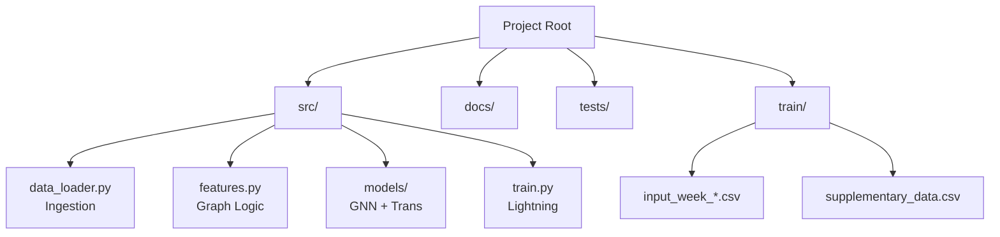

# Installation & Setup Guide

This guide covers the specialized environment setup required for the NFL Analytics Engine.

## Prerequisites
*   **OS**: Linux (Ubuntu 20.04+ recommended) or macOS.
*   **Python**: Version 3.9 or higher.
*   **Hardware**: NVIDIA GPU (8GB+ VRAM) recommended for full training. CPU works for inference/sanity checks.

## Step-by-Step Installation

### 1. Clone the Repository
```bash
git clone https://github.com/your-org/nfl-analytics.git
cd nfl-analytics
```

### 2. Virtual Environment Setup
It is critical to use a virtual environment to manage PyTorch and PyTorch Geometric dependencies.

```bash
# Create virtual environment
python -m venv .venv

# Activate (Linux/Mac)
source .venv/bin/activate
```

### 3. Install Dependencies
We strictly separate core libraries from research tools.

```bash
# Upgrade pip first
pip install --upgrade pip

# Install requirements
pip install -r requirements.txt
```

> **Note on PyTorch Geometric**: If you encounter installation errors regarding `torch-scatter` or `torch-sparse`, please install them manually specifying your CUDA version:
> ```bash
> pip install torch-scatter torch-sparse -f https://data.pyg.org/whl/torch-2.0.0+cu118.html
> ```

## Project Structure
Understanding the layout is key to navigation.



## Verify Installation
Run the following command to ensure all libraries are active and the model can compile:

```bash
python -c "import torch; import torch_geometric; print('Installation Success! GPU:', torch.cuda.is_available())"
```
