# Performance Guide

> Benchmarks, optimization techniques, and GPU utilization strategies.

## 📊 Performance Benchmarks

### Training Speed (RTX 3050 4GB)


| Configuration | Speed | Epoch Time | GPU Util |
|---------------|-------|------------|----------|
| No Cache | 0.13 it/s | ~6.5 hours | ~10% |
| **With Cache** | 1.2 it/s | ~70 min | ~60% |
| **Cache + FP16** | 2.1 it/s | ~45 min | ~80% |

### Memory Usage (12M Parameter Model)


| Component | Size | Notes |
|-----------|------|-------|
| Model (FP16) | ~800 MB | 12M params × 2 bytes |
| Batch (16) | ~1.2 GB | 16 graphs |
| Gradients | ~1.5 GB | Accumulated |
| Optimizer | ~500 MB | Adam states |
| **Total** | **~4.0 GB** | Fits! ✅ |

---

## ⚡ Optimization Techniques

### 1. Graph Pre-Caching (15× Speedup)

```mermaid
flowchart LR
    subgraph Before["Without Cache"]
        B1["CPU: Build Graph"] --> B2["GPU: Forward"]
        B2 --> B3["CPU: Build Graph"]
        B3 --> B4["GPU: Forward"]
    end
    
    subgraph After["With Cache"]
        A1["Disk: Load Graph"] --> A2["GPU: Forward"]
        A2 --> A3["Disk: Load Graph"]
        A3 --> A4["GPU: Forward"]
    end
    
    Before --> |"15× faster"| After
```



**Implementation:**
```bash
# Pre-cache 185K graphs (~30 min)
python -c "
from src.data_loader import *
from pathlib import Path

loader = DataLoader('.')
tuples = expand_play_tuples(
    build_play_metadata(loader, list(range(1,19)), 5, 10)
)

ds = GraphDataset(loader, tuples, 30.0, 10, 5,
    cache_dir=Path('cache/finetune/train'), persist_cache=True)
for i, _ in enumerate(ds):
    if i % 1000 == 0: print(f'{i}/{len(ds)}')
"
```

### 2. Mixed Precision (2× Speedup)


**Enable:**
```python
trainer = Trainer(precision="16-mixed")
torch.set_float32_matmul_precision('medium')
```

### 3. Gradient Accumulation


**Effect:**
- Batch size: 16
- Accumulate: 12
- **Effective batch: 192**

---

## 🎯 Target Metrics

### Competition Targets (12M Model)


### Metric Definitions

| Metric | Formula | Lower = Better |
|--------|---------|----------------|
| **ADE** | Σ‖pred - gt‖ / (N×T) | ✓ |
| **FDE** | ‖pred_T - gt_T‖ / N | ✓ |
| **minADE** | min_k(ADE_k) | ✓ |
| **minFDE** | min_k(FDE_k) | ✓ |
| **Miss Rate** | %{FDE > 2} | ✓ |

---

## 🔧 Hardware Requirements

### Minimum (RTX 3050 4GB)

| Resource | Requirement |
|----------|-------------|
| GPU VRAM | 4 GB |
| RAM | 16 GB |
| Disk | 10 GB (cache) |
| CPU | 4+ cores |

### Recommended (RTX 3060+)

| Resource | Requirement |
|----------|-------------|
| GPU VRAM | 8+ GB |
| RAM | 32 GB |
| Disk | 20 GB SSD |
| CPU | 8+ cores |

---

## 📈 Monitoring

### Real-Time GPU Stats

```bash
# Watch GPU usage
watch -n 1 nvidia-smi

# Detailed query
nvidia-smi --query-gpu=utilization.gpu,memory.used,temperature.gpu --format=csv -l 1
```

### TensorBoard Metrics


```bash
tensorboard --logdir lightning_logs/
```

---

## 🚀 Speed Optimization Checklist

```mermaid
flowchart TB
    C1["✅ Pre-cache graphs"] --> R1["15× speedup"]
    C2["✅ Mixed precision"] --> R2["2× speedup"]
    C3["✅ benchmark=True"] --> R3["10% speedup"]
    C4["✅ Tensor Cores"] --> R4["FP16 ops"]
    C5["✅ SSD for cache"] --> R5["Faster I/O"]
    C6["✅ pin_memory"] --> R6["Fast transfer"]
```



---

## 🔍 Bottleneck Diagnosis

### Low GPU Utilization (< 50%)


### OOM Errors


**Fix:**
```yaml
batch_size: 12          # Reduce from 16
num_modes: 12           # Reduce from 16
accumulate_grad_batches: 16  # Increase
```
