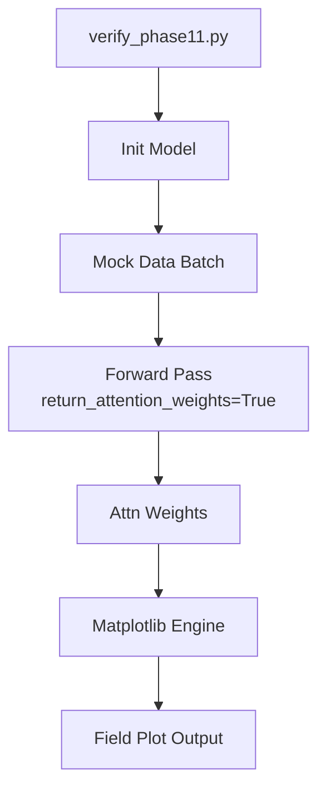

# Testing & Verification Strategy

This project employs a tiered reliability strategy ranging from unit verification to visual explainability.

## 1. Sanity Checks
Sanity checks are fast, end-to-end runs designed to crash early if something is broken.

### Quick Run
```bash
python -m src.train --mode train --sanity
```
**What it does:**
1.  Loads a single game (Week 1, Game 1).
2.  Vectorizes only 500 frames.
3.  Trains for 10 batches.
4.  Reports `Validation Accuracy` and `MSE`.
**Pass Criteria**: Exit code 0, Accuracy > 0%.

## 2. Phase Verification Scripts
Specific scripts verify the complexity added in each major upgrade phase.

| Script | Purpose | Key Check |
| :--- | :--- | :--- |
| `tests/verify_rules.py` | Data Integrity | Nullified plays are removed? |
| `tests/verify_phase8.py` | Context Fusion | Context tensor shape `[B, 3]`? |
| `tests/verify_phase11.py`| **Strategic Embeddings** | Input dim 7 works? Embeddings fuse? |

**Run Example**:
```bash
python tests/verify_phase11.py
```

## 3. Visual Verification (Explainability)
We trust the model only when we can see *why* it makes decisions.

### Generating Attention Maps
Use `src/visualization.py` to plot the Graph Attention weights.
1.  **Beams**: Opacity of lines between players indicates GNN Attention.
2.  **Logic**: Strong beams from QB to WR suggest the model "anticipates" a pass.



## 4. Performance Metrics
*   **ADE (Average Displacement Error)**: Mean Euclidean distance between predicted and actual path over 1 second.
*   **FDE (Final Displacement Error)**: Distance error at exactly $t=10$.
*   **Coverage Accuracy**: % of plays correctly classified as Man vs. Zone.
