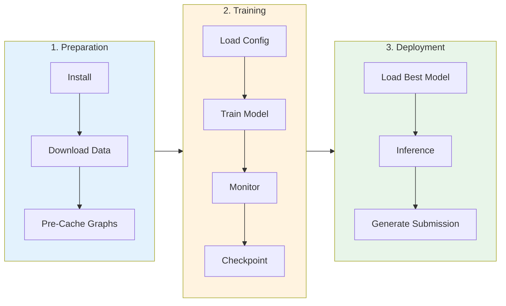
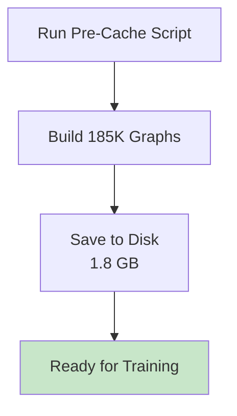
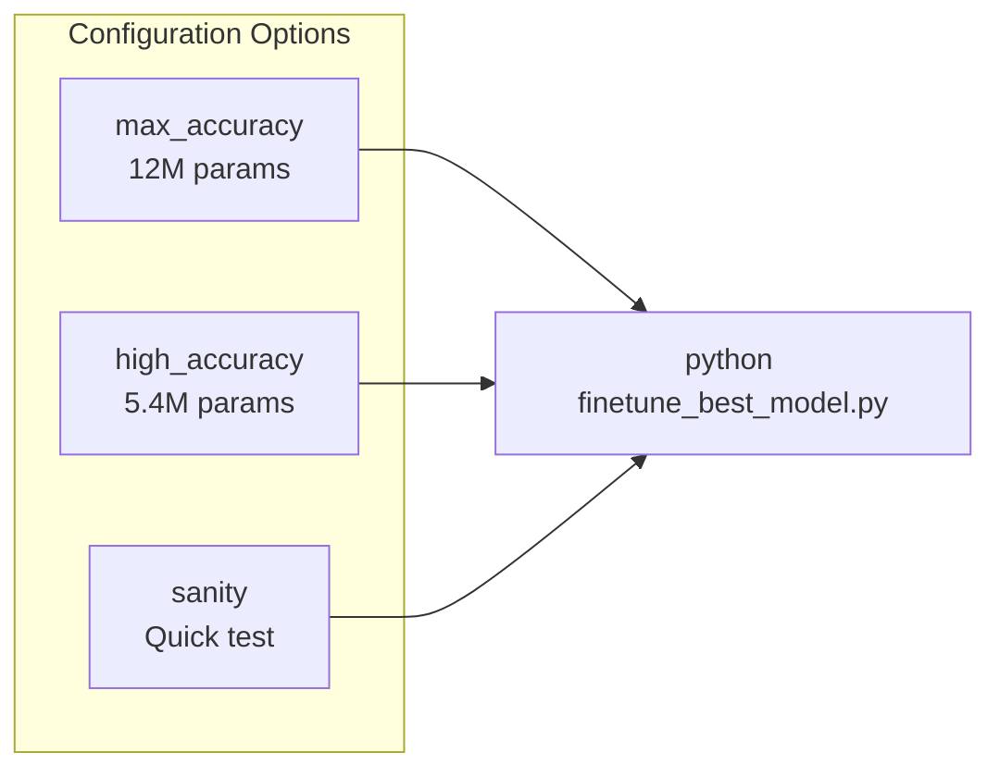
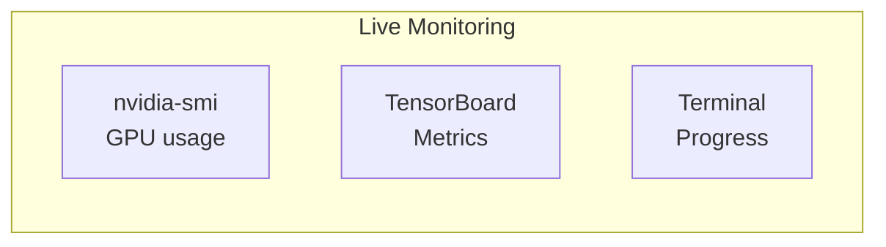
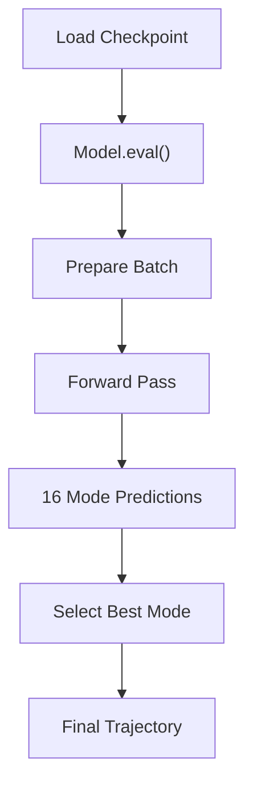
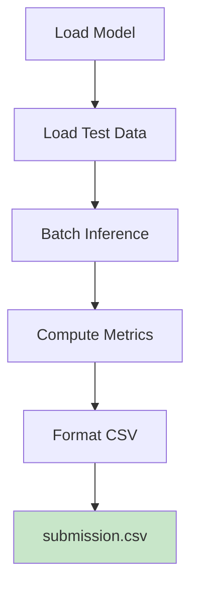

# Usage Guide

> Complete workflow for training, inference, and competition submission.

## 🚀 Quick Start Workflow



---

## 📥 1. Preparation

### Install Dependencies

```bash
git clone https://github.com/tanm-sys/nfl-analytics-engine.git
cd nfl-analytics-engine
pip install -e .
```

### Pre-Cache Graphs (Required)



```bash
python -c "
from src.data_loader import *
from pathlib import Path

loader = DataLoader('.')
tuples = expand_play_tuples(
    build_play_metadata(loader, list(range(1,19)), 5, 10)
)

ds = GraphDataset(loader, tuples, 30.0, 10, 5,
    cache_dir=Path('cache/finetune/train'), persist_cache=True)
for i, _ in enumerate(ds):
    if i % 1000 == 0: print(f'{i}/{len(ds)}')
"
```

---

## 🎯 2. Training

### Training Commands



```bash
# Maximum parameters (competition grade)
python finetune_best_model.py --config configs/max_accuracy_rtx3050.yaml

# Quick test
python finetune_best_model.py --config configs/sanity.yaml
```

### Monitor Training



```bash
# Terminal 1: Training
python finetune_best_model.py --config configs/max_accuracy_rtx3050.yaml

# Terminal 2: GPU monitor
watch -n 1 nvidia-smi

# Terminal 3: TensorBoard
tensorboard --logdir lightning_logs/
```

### Training Output

```
Epoch 0/199 ━━━━━━━━━━━━━━━━ 73/9234 0:00:34 • 1:13:22 2.08it/s v_num: 1.000
```

---

## 🔮 3. Inference

### Load Trained Model



```python
from src.train import NFLGraphPredictor
import torch

# Load best checkpoint
model = NFLGraphPredictor.load_from_checkpoint(
    "checkpoints_finetuned/best.ckpt",
    map_location="cuda"
)
model.eval()

# Prepare data
from torch_geometric.data import Data, Batch

data = Data(
    x=torch.randn(22, 9),
    edge_index=torch.randint(0, 22, (2, 100)),
    edge_attr=torch.randn(100, 5),
    current_pos=torch.randn(22, 2),
    context=torch.randn(1, 3),
)
batch = Batch.from_data_list([data]).to("cuda")

# Predict
with torch.no_grad():
    predictions, coverage, _ = model.model(batch)
    
print(predictions.shape)  # [22, 10, 2]
```

### Multi-Modal Prediction

```python
# Get all 16 modes
with torch.no_grad():
    params, probs, _, _ = model.model(batch, return_distribution=True)

# params: [N, 10, 16, 5] - mu_x, mu_y, sigma_x, sigma_y, rho
# probs: [N, 16] - mode probabilities

# Best mode selection
best_mode = probs.argmax(dim=-1)  # [N]
mu = params[..., :2]  # [N, 10, 16, 2]

# Get best trajectory per player
for i in range(22):
    best_traj = mu[i, :, best_mode[i], :]  # [10, 2]
```

---

## 📤 4. Competition Submission

### Generate Predictions



```bash
python -m src.competition_output \
    --checkpoint checkpoints_finetuned/best.ckpt \
    --data-dir . \
    --weeks 1 2 3 4 5 6 7 8 9 \
    --output submission.csv \
    --batch-size 64
```

### Output Format

```csv
game_id,play_id,node_idx,frame_id,predicted_x,predicted_y,confidence_lower_x,confidence_upper_x,confidence_lower_y,confidence_upper_y
2023090700,1,0,0,45.23,26.15,44.12,46.34,25.04,27.26
...
```

---

## 📈 5. Evaluation

### Compute Metrics

```python
from src.metrics import compute_ade, compute_fde, compute_miss_rate

# predictions: [N, T, 2], targets: [N, T, 2]
ade = compute_ade(predictions, targets)
fde = compute_fde(predictions, targets)
miss_rate = compute_miss_rate(predictions, targets, threshold=2.0)

print(f"ADE: {ade:.4f} yards")
print(f"FDE: {fde:.4f} yards")
print(f"Miss Rate: {miss_rate:.2%}")
```

### Multi-Modal Metrics

```python
# For minADE/minFDE with 16 modes
from src.metrics import compute_min_ade

# all_modes: [N, T, 16, 2]
min_ade = compute_min_ade(all_modes, targets)
min_fde = compute_min_fde(all_modes, targets)
```

---

## 🎨 6. Visualization

### Trajectory Plot

```python
from src.visualization import plot_trajectories

plot_trajectories(
    predictions=predictions,   # [N, 10, 2]
    ground_truth=targets,      # [N, 10, 2]
    current_pos=current_pos,   # [N, 2]
    output_path="trajectories.png"
)
```

### Multi-Modal Visualization

```python
from src.visualization import plot_multimodal

plot_multimodal(
    modes=all_modes,           # [N, 10, 16, 2]
    mode_probs=probs,          # [N, 16]
    ground_truth=targets,
    player_idx=5,
    output_path="multimodal.png"
)
```

---

## 🔧 Advanced Usage

### Resume Training

```bash
python finetune_best_model.py \
    --config configs/max_accuracy_rtx3050.yaml \
    --resume checkpoints_finetuned/last.ckpt
```

### Custom Configuration

```yaml
# my_config.yaml
hidden_dim: 512
num_modes: 20
batch_size: 8
learning_rate: 0.00005
```

```bash
python finetune_best_model.py --config my_config.yaml
```
